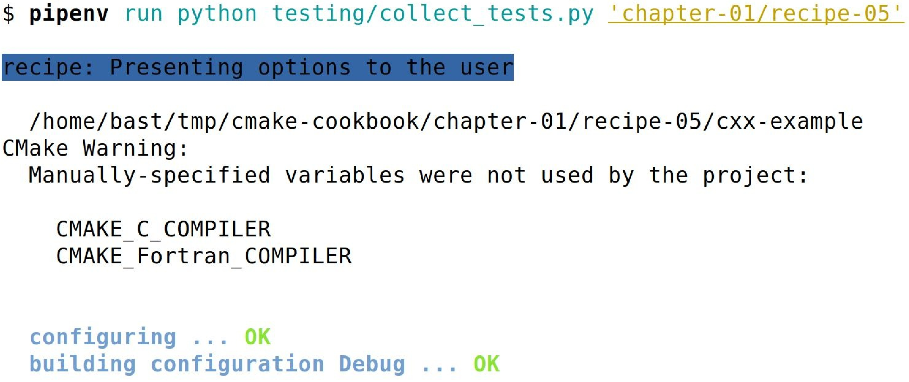

# 0.4 测试环境

示例在下列持续集成(CI)上进行过测试：

* Travis( https://travis-ci.org )用于GNU/Linux和macOS
* Appveyor( https://www.appveyor.com )用于Windows
* CircleCI ( https://circleci.com )用于附加的GNU/Linux测试和商业编译器

CI服务的配置文件可以在示例库中找到( https://github.com/dev-cafe/cmake-cookbook/ ): 

* Travis的配置文件为`travis.yml`
* Appveyor的配置文件为`.appveyor.yml`
* CircleCI的配置文件为`.circleci/config.yml`
* Travis和Appveyor的其他安装脚本，可以在` testing/dependencies`文件夹中找到。

**NOTE**:*GNU/Linux系统上，Travis使用CMake 3.5.2和CMake 3.12.1对实例进行测试。macOS系统上用CMake 3.12.1进行测试。Appveyor使用CMake 3.11.3进行测试。Circle使用CMake 3.12.1进行测试。*

测试机制是一组Python脚本，包含在`testing`文件夹中。脚本`collect_tests.py`将运行测试并报告它们的状态。示例也可以单独测试，也可以批量测试；` collect_tests.py`接受正则表达式作为命令行输入，例如:

```shell
$ pipenv run python testing/collect_tests.py 'chapter-0[1,7]/recipe-0[1,2,5]'
```

该命令将对第1章和第7章的示例1、2和5进行测试。输出的示例如下:



要获得更详细的输出，可以设置环境变量`VERBOSE_OUTPUT=ON`：

```shell
$ env VERBOSE_OUTPUT=ON pipenv run python testing/collect_tests.py 'chapter-*/recipe-*'
```

