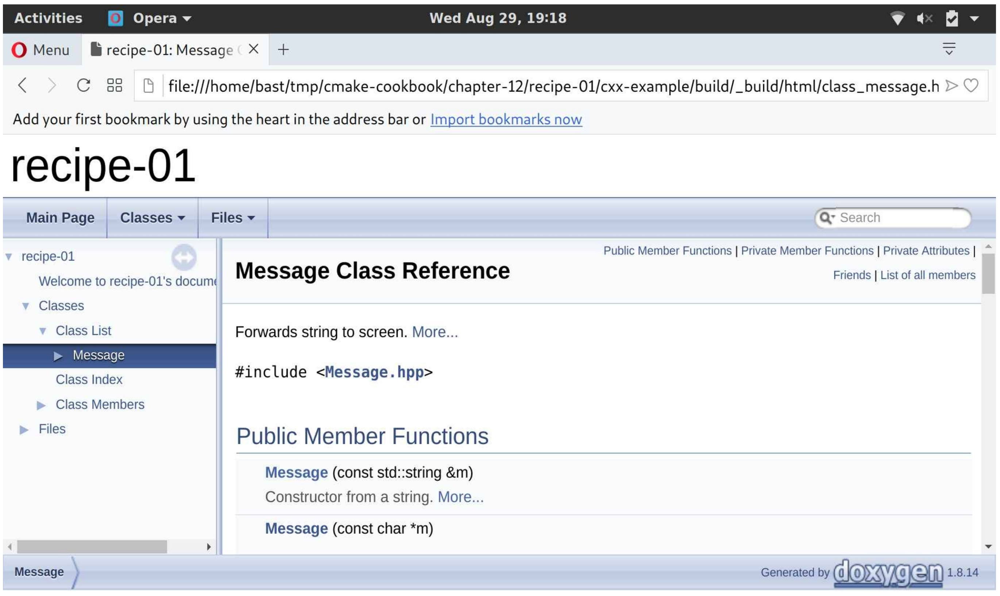

# 12.1 使用Doxygen构建文档

**NOTE**:*此示例代码可以在 https://github.com/dev-cafe/cmake-cookbook/tree/v1.0/chapter-12/recipe-01 中找到，其中包含一个C++示例。该示例在CMake 3.5版(或更高版本)中是有效的，并且已经在GNU/Linux、macOS和Windows上进行过测试。*

Doxygen(http://www.doxygen.nl )是非常流行的源代码文档工具。可以在代码中添加文档标记作为注释，而后运行Doxygen提取这些注释，并以Doxyfile配置文件中定义的格式创建文档。Doxygen可以输出HTML、XML，甚至LaTeX或PDF。本示例将展示，如何使用CMake来构建Doxygen文档。

## 准备工作

使用前几章中介绍的消息库的简化版本。目录结构如下:

```shell
.
├── cmake
│    └── UseDoxygenDoc.cmake
├── CMakeLists.txt
├── docs
│    ├── Doxyfile.in
│    └── front_page.md
└── src
    ├── CMakeLists.txt
    ├── hello-world.cpp
    ├── Message.cpp
    └── Message.hpp
```

我们仍然在`src`子目录下放置源代码，并且在CMake子目录中有自定义的CMake模块。由于重点是文档，所以消除了对UUID的依赖，并简化了源代码。最大的区别是头文件中的大量代码注释：

```c++
#pragma once

#include <iosfwd>
#include <string>

/ * ! \file Message.hpp * /

/*! \class Message
* \brief Forwards string to screen
* \author Roberto Di Remigio
* \date 2018
* /

class Message {
public:
  /*! \brief Constructor from a string
  * \param[in] m a message
  */
  Message(const std::string &m) : message_(m) {}
  /*! \brief Constructor from a character array
  * \param[in] m a message
  */
  Message(const char * m): message_(std:: string(m)){}
  
  friend std::ostream &operator<<(std::ostream &os, Message &obj) {
    return obj.printObject(os);
  }
private:
  /*! The message to be forwarded to screen */
  std::string message_;
  /*! \brief Function to forward message to screen
  * \param[in, out] os output stream
  */
  std::ostream &printObject(std::ostream &os);
};
```

这些注释的格式是`/*!*/`，并包含一些Doxygen可以理解的特殊标记(参见http://www.stack.nl/~dimitri/Doxygen/manual/docblocks.html )。

## 具体实施

首先，来看看根目录下的`CMakeLists.txt`：

1. 我们声明了一个C++11项目：

   ```cmake
   cmake_minimum_required(VERSION 3.5 FATAL_ERROR)
   project(recipe-01 LANGUAGES CXX)
   set(CMAKE_CXX_STANDARD 11)
   set(CMAKE_CXX_EXTENSIONS OFF)
   set(CMAKE_CXX_STANDARD_REQUIRED ON)
   ```

2. 为动态库和静态库，以及可执行文件定义了输出目录：

   ```cmake
   include(GNUInstallDirs)
   set(CMAKE_ARCHIVE_OUTPUT_DIRECTORY
   	${CMAKE_BINARY_DIR}/${CMAKE_INSTALL_LIBDIR})
   set(CMAKE_LIBRARY_OUTPUT_DIRECTORY
   	${CMAKE_BINARY_DIR}/${CMAKE_INSTALL_LIBDIR})
   set(CMAKE_RUNTIME_OUTPUT_DIRECTORY
   	${CMAKE_BINARY_DIR}/${CMAKE_INSTALL_BINDIR})
   ```

3. 将`cmake`子目录追加到`CMAKE_MODULE_PATH`。这是需要CMake找到我们的自定义模块：

   ```cmake
   list(APPEND CMAKE_MODULE_PATH "${CMAKE_SOURCE_DIR}/cmake")
   ```

4. `UseDoxygenDoc.cmake`自定义模块。将在后面讨论它的内容:

   ```cmake
   include(UseDoxygenDoc)
   ```

5. 然后添加`src`子目录:

   ```cmake
   add_subdirectory(src)
   ```

`src`子目录中的`CMakeLists.txt`文件包含以下构建块:

1. 添加了消息库:

   ```cmake
   add_library(message STATIC
     Message.hpp
     Message.cpp
     )
   ```

2. 然后，声明`add_doxygen_doc`函数。这个函数可以理解这些参数：BUILD_DIR、DOXY_FILE、TARGET_NAME和COMMENT。使用`cmake_parse_arguments`标准CMake命令解析这些参数：

   ```cmake
   function(add_doxygen_doc)
     set(options)
     set(oneValueArgs BUILD_DIR DOXY_FILE TARGET_NAME COMMENT)
     set(multiValueArgs)
     
     cmake_parse_arguments(DOXY_DOC
       "${options}"
       "${oneValueArgs}"
       "${multiValueArgs}"
       ${ARGN}
     )
   
     # ...
   endfunction()
   ```

3. Doxyfile包含用于构建文档的所有Doxygen设置。一个模板`Doxyfile.in`文件作为函数参数`DOXY_FILE`传递，并解析为`DOXY_DOC_DOXY_FILE`变量。使用如下方式，配置模板文件`Doxyfile.in`:

   ```cmake
   configure_file(
     ${DOXY_DOC_DOXY_FILE}
     ${DOXY_DOC_BUILD_DIR}/Doxyfile
     @ONLY
     )
   ```

4. 然后，定义了一个名为`DOXY_DOC_TARGET_NAME`的自定义目标，它将使用Doxyfile中的设置执行Doxygen，并在`DOXY_DOC_BUILD_DIR`中输出结果:

   ```cmake
   add_custom_target(${DOXY_DOC_TARGET_NAME}
     COMMAND
       ${DOXYGEN_EXECUTABLE} Doxyfile
     WORKING_DIRECTORY
       ${DOXY_DOC_BUILD_DIR}
     COMMENT
       "Building ${DOXY_DOC_COMMENT} with Doxygen"
     VERBATIM
     )
   ```

5. 最后，为用户打印一条状态信息:

   ```cmake
   message(STATUS "Added ${DOXY_DOC_TARGET_NAME} [Doxygen] target to build documentation")
   ```

可以像往常一样配置项目：

```shell
$ mkdir -p build
$ cd build
$ cmake ..
$ cmake --build .
```

可以通过调用自定义文档目标来构建文档:

```shell
$ cmake --build . --target docs
```

您将注意到构建树中出现了一个`_build`子目录。它包含Doxygen从源文件生成的HTML文档。用浏览器打开`index.html`将显示Doxygen欢迎页面。

如果导航到类列表，例如：可以浏览Message类的文档:



## 工作原理

默认情况下，CMake不支持文档构建。但是，我们可以使用`add_custom_target`执行任意操作。需要注意的是，需要确保构建文档所需的工具(本例中是Doxygen和Perl)在系统上可用。

此外，请注意`  UseDoxygenDoc.cmake`自定义模块只做以下工作:

* 执行对Doxygen和Perl可执行程序的搜索
* 定义函数

使用`add_doxygen_doc`函数对文档目标进行创建。这个显式模式要优于隐式模式，我们也认为这是很好的实践方式：不要使用模块来执行类似宏(或函数)的操作。

为了限制变量定义的范围和可能出现的副作用，我们使用函数而不是宏实现了`add_doxygen_doc`。这种情况下，函数和宏都可以工作(并且会产生相同的结果)，但是建议优先使用函数而不是宏，除非需要修改父范围中的变量。

**NOTE**:*在cmake 3.9中添加了`FindDoxygen.cmake`模块。实现了`doxygen_add_docs`函数，其行为与我们在本示例中给出的宏类似。要了解更多细节，请访问https://cmake.org/cmake/help/v3.9/module/FindDoxygen.html 查看在线文档。*

