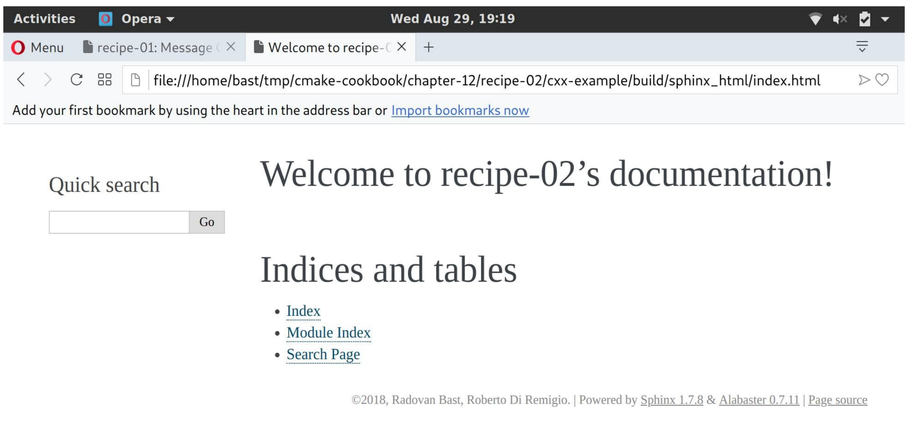

# 12.2 使用Sphinx构建文档

**NOTE**:*此示例代码可以在 https://github.com/dev-cafe/cmake-cookbook/tree/v1.0/chapter-12/recipe-02 中找到，其中包含一个C++示例。该示例在CMake 3.5版(或更高版本)中是有效的，并且已经在GNU/Linux、macOS和Windows上进行过测试。*

Sphinx是一个Python程序，也是一个非常流行的文档系统(http://www.sphinx-doc.org )。当与Python项目一起使用时，可以为`docstring`解析源文件，并自动为函数和类生成文档页面。然而，Sphinx不仅限于Python，还可以解析reStructuredText、Markdown，并生成HTML、ePUB或PDF文档。还有在线阅读服务(https://readthedocs.org )，它提供了一种快速编写和部署文档的方法。本示例将向您展示，如何使用CMake构建Sphinx文档。

## 准备工作

我们希望建立一个简单的网站，记录我们的消息库输出的信息。源码树现在看起来如下:

```shell
.
├── cmake
│    ├── FindSphinx.cmake
│    └── UseSphinxDoc.cmake
├── CMakeLists.txt
├── docs
│    ├── conf.py.in
│    └── index.rst
└── src
    ├── CMakeLists.txt
    ├── hello-world.cpp
    ├── Message.cpp
    └── Message.hpp
```

`cmake`子目录中有一些自定义模块，`docs`子目录以纯文本reStructuredText格式的网站主页，`index.rst`和一个带有Sphinx的设置Python模板文件`conf.py.in`，这个模板文件可以使用`sphinx-quickstart`程序自动生成。

## 具体实施

与之前的示例相比，我们将修改主`CMakeLists.txt`文件，并实现一个函数(`add_sphinx_doc`):

1. 将`cmake`文件夹附加到`CMAKE_MODULE_PATH`之后，我们将包括`UseSphinxDoc.cmake`自定义模块:

   ```cmake
   list(APPEND CMAKE_MODULE_PATH "${CMAKE_SOURCE_DIR}/cmake")
   include(UseSphinxDoc)
   ```

2. `UseSphinxDoc.cmake`模块定义了`add_sphinx_doc`函数。我们使用关键字参数调用这个函数，以便对Sphinx文档的构建进行设置。自定义文档目标将称为`docs`:

   ```cmake
   add_sphinx_doc(
     SOURCE_DIR
     	${CMAKE_CURRENT_SOURCE_DIR}/docs
     BUILD_DIR
     	${CMAKE_CURRENT_BINARY_DIR}/_build
     CACHE_DIR
     	${CMAKE_CURRENT_BINARY_DIR}/_doctrees
     HTML_DIR
     	${CMAKE_CURRENT_BINARY_DIR}/sphinx_html
     CONF_FILE
     	${CMAKE_CURRENT_SOURCE_DIR}/docs/conf.py.in
     TARGET_NAME
     	docs
     COMMENT
     	"HTML documentation"
     )
   ```

`UseSphinxDoc.cmake`模块遵循相同的显式方式，这样的使用方式要优于在前一个示例中的隐式方式：

1. 需要找到Python解释器和Sphinx可执行文件，如下:

   ```cmake
   find_package(PythonInterp REQUIRED)
   find_package(Sphinx REQUIRED)
   ```

2. 然后，用一个值关键字参数定义`add_sphinx_doc`函数，并用`cmake_parse_arguments`解析：

   ```cmake
   function(add_sphinx_doc)
     set(options)
     set(oneValueArgs
       SOURCE_DIR
       BUILD_DIR
       CACHE_DIR
       HTML_DIR
       CONF_FILE
       TARGET_NAME
       COMMENT
       )
   
     set(multiValueArgs)
   
     cmake_parse_arguments(SPHINX_DOC
       "${options}"
       "${oneValueArgs}"
       "${multiValueArgs}"
       ${ARGN}
       )
   
     # ...
     
   endfunction()
   ```

3. 模板文件`conf.py.in`作为`CONF_FILE`关键字参数传递，在`SPHINX_DOC_BUILD_DIR`中配置为`conf.py`：

   ```cmake
   configure_file(
     ${SPHINX_DOC_CONF_FILE}
     ${SPHINX_DOC_BUILD_DIR}/conf.py
     @ONLY
     )
   ```

4. 添加了一个名为`SPHINX_DOC_TARGET_NAME`的自定义目标，用Sphinx来编排文档构建:

   ```cmake
   add_custom_target(${SPHINX_DOC_TARGET_NAME}
     COMMAND
       ${SPHINX_EXECUTABLE}
         -q
         -b html
         -c ${SPHINX_DOC_BUILD_DIR}
         -d ${SPHINX_DOC_CACHE_DIR}
         ${SPHINX_DOC_SOURCE_DIR}
         ${SPHINX_DOC_HTML_DIR}
     COMMENT
       "Building ${SPHINX_DOC_COMMENT} with Sphinx"
     VERBATIM
     )
   ```

5. 最后，打印一条状态信息:

   ```cmake
   message(STATUS "Added ${SPHINX_DOC_TARGET_NAME} [Sphinx] target to build documentation")
   ```

6. 配置项目并构建了文档目标:

   ```shell
   $ mkdir -p build
   $ cd build
   $ cmake ..
   $ cmake --build . --target docs
   ```

这将生成`SPHINX_DOC_HTML_DIR`中的HTML文档
生成树的子目录。同样，可以使用浏览器打开`index.html`，并查看文档:



## 工作原理

我们利用`add_custom_target`的功能，可以向构建系统添加任意的构建目标。本例中，文档将使用Sphinx构建。由于Sphinx是一个可以与其他Python模块一起扩展的Python程序，所以`docs`目标将依赖于Python解释器。我们使用`find_package`确保依赖关系。需要注意的是，`FindSphinx.cmake`模块还不是一个标准的CMake模块；它的副本包含在项目源代码中，位于`cmake`子目录下。