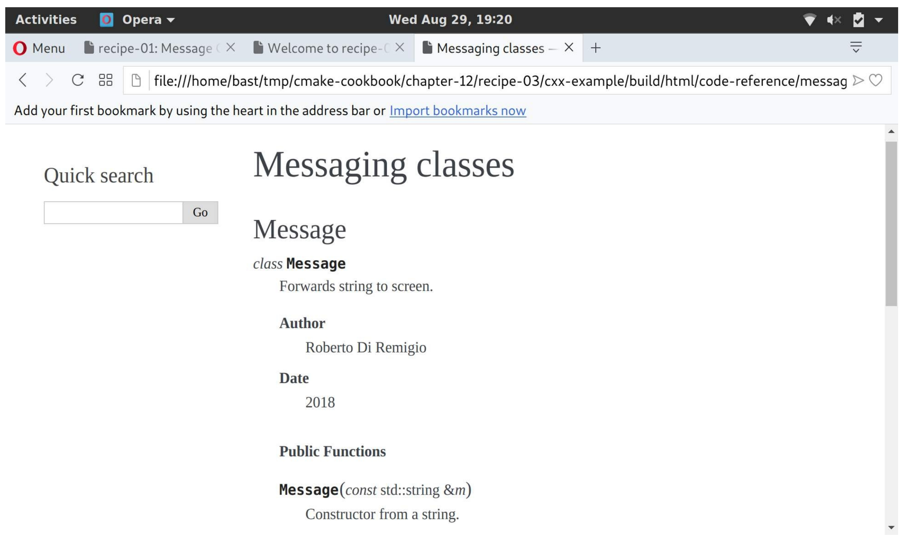

# 12.3 结合Doxygen和Sphinx

**NOTE**:*此示例代码可以在 https://github.com/dev-cafe/cmake-cookbook/tree/v1.0/chapter-12/recipe-03 中找到，其中包含一个C++示例。该示例在CMake 3.5版(或更高版本)中是有效的，并且已经在GNU/Linux、macOS和Windows上进行过测试。*

我们有一个C++项目，因此Doxygen是生成源代码文档的理想选择。然而，我们也希望发布面向用户的文档，例如：介绍设计选择。所以我们想使用Sphinx，因为生成的HTML也可以在移动设备上查看，而且可以部署文档进行在线阅读(https://readthedocs.org )。本教程将演示如何使用Breathe插件(https://breathe.readthedocs.io )组合Doxygen和Sphinx。

## 准备工作

这个示例的目录结构，类似于之前的两个示例:

```shell
.
├── cmake
│    ├── FindPythonModule.cmake
│    ├── FindSphinx.cmake
│    └── UseBreathe.cmake
├── CMakeLists.txt
├── docs
│    ├── code-reference
│    │    ├── classes-and-functions.rst
│    │    └── message.rst
│    ├── conf.py.in
│    ├── Doxyfile.in
│    └── index.rst
└── src
    ├── CMakeLists.txt
    ├── hello-world.cpp
    ├── Message.cpp
    └── Message.hpp
```

`docs`子目录现在同时包含一个` Doxyfile.in`和一个`conf.py.in`模板文件。模板文件中，分别设置了Doxygen和Sphinx。此外，还有一个`code-referenc`子目录。

`code-referenc`子目录中的文件包含Breathe指令，用来在Sphinx中包含doxygen生成的文档：

```txt
Messaging classes
=================
Message
-------
..  doxygenclass:: Message
    :project: recipe-03
    :members:
    :protected-members:
    :private-members:
```

这将输出Message类的文档。

## 具体实施

`src`目录中的`CMakeLists.txt`文件没有改变。主`CMakeLists.txt`文件中有修改：

1. 包含` UseBreathe.cmake`自定义模块：

   ```cmake
   list(APPEND CMAKE_MODULE_PATH "${CMAKE_SOURCE_DIR}/cmake")
   include(UseBreathe)
   ```

2. 调用`add_breathe_doc`函数，这个函数是在自定义模块中定义的，它接受关键字参数，来设置Doxygen和Sphinx：

   ```cmake
   add_breathe_doc(
     SOURCE_DIR
       ${CMAKE_CURRENT_SOURCE_DIR}/docs
     BUILD_DIR
       ${CMAKE_CURRENT_BINARY_DIR}/_build
     CACHE_DIR
       ${CMAKE_CURRENT_BINARY_DIR}/_doctrees
     HTML_DIR
       ${CMAKE_CURRENT_BINARY_DIR}/html
     DOXY_FILE
       ${CMAKE_CURRENT_SOURCE_DIR}/docs/Doxyfile.in
     CONF_FILE
       ${CMAKE_CURRENT_SOURCE_DIR}/docs/conf.py.in
     TARGET_NAME
       docs
     COMMENT
       "HTML documentation"
     )
   ```

让我们看一下`UseBreatheDoc.cmake`模块，其遵循了与我们在前两个示例中描述的显式模式。具体描述如下:

1. 文档生成依赖于Doxygen:

   ```cmake
   find_package(Doxygen REQUIRED)
   find_package(Perl REQUIRED)
   ```

2. 还依赖于Python解释器和Sphinx:

   ```cmake
   find_package(PythonInterp REQUIRED)
   find_package(Sphinx REQUIRED)
   ```

3. 此外，还必须找到breathe的Python模块。这里，我们使用`FindPythonModule.cmake`模块:

   ```cmake
   include(FindPythonModule)
   find_python_module(breathe REQUIRED)
   ```

4. 定义了`add_breathe_doc`函数，这个函数有一个单值关键字参数，我们将使用`cmake_parse_arguments`命令解析它:

   ```cmake
   function(add_breathe_doc)
     set(options)
     set(oneValueArgs
       SOURCE_DIR
       BUILD_DIR
       CACHE_DIR
       HTML_DIR
       DOXY_FILE
       CONF_FILE
       TARGET_NAME
       COMMENT
       )
     set(multiValueArgs)
   
     cmake_parse_arguments(BREATHE_DOC
       "${options}"
       "${oneValueArgs}"
       "${multiValueArgs}"
       ${ARGN}
       )
   
     # ...
   
   endfunction()
   ```

5. `BREATHE_DOC_CONF_FILE`中的Sphinx模板文件，会通过`conf.py`配置到的`BREATHE_DOC_BUILD_DIR`目录下：

   ```cmake
   configure_file(
     ${BREATHE_DOC_CONF_FILE}
     ${BREATHE_DOC_BUILD_DIR}/conf.py
     @ONLY
     )
   ```

6. 相应地，Doxygen的`BREATHE_DOC_DOXY_FILE`模板文件配置为`BREATHE_DOC_BUILD_DIR`中的Doxyfile:

   ```cmake
   configure_file(
     ${BREATHE_DOC_DOXY_FILE}
     ${BREATHE_DOC_BUILD_DIR}/Doxyfile
     @ONLY
     )
   ```

7. 添加`BREATHE_DOC_TARGET_NAME`自定义目标。注意，只有Sphinx在运行时，对Doxygen的调用才发生在`BREATHE_DOC_SPHINX_FILE`中:

   ```cmake
   add_custom_target(${BREATHE_DOC_TARGET_NAME}
     COMMAND
       ${SPHINX_EXECUTABLE}
         -q
         -b html
         -c ${BREATHE_DOC_BUILD_DIR}
         -d ${BREATHE_DOC_CACHE_DIR}
         ${BREATHE_DOC_SOURCE_DIR}
         ${BREATHE_DOC_HTML_DIR}
     COMMENT
       "Building ${BREATHE_DOC_TARGET_NAME} documentation with Breathe, Sphinx and Doxygen"
     VERBATIM
     )
   ```

8. 最后，打印一条状态信息:

   ```cmake
   message(STATUS "Added ${BREATHE_DOC_TARGET_NAME} [Breathe+Sphinx+Doxygen] target to build documentation")
   ```

9. 配置完成后，构建文档:

   ```shell
   $ mkdir -p build
   $ cd build
   $ cmake ..
   $ cmake --build . --target docs
   ```

该文档将在`BREATHE_DOC_HTML_DIR`子目录中可用。启动浏览器打开`index.html`文件后，可以导航到Message类的文档:



## 工作原理

尽管在声明定制的`BREATHE_DOC_TARGET_NAME`目标时只调用了Sphinx，但这里Doxygen和Sphinx都在运行。这要感谢Sphinx的`conf.py`文件中的以下设置:

```python
def run_doxygen(folder):
  """Run the doxygen make command in the designated folder"""

  try:
      retcode = subprocess.call("cd {}; doxygen".format(folder), shell=True)
    if retcode < 0:
      sys.stderr.write(
      "doxygen terminated by signal {}".format(-retcode))
  except OSError as e:
    sys.stderr.write("doxygen execution failed: {}".format(e))


def setup(app):
  run_doxygen('@BREATHE_DOC_BUILD_DIR@')
```

Doxygen将生成XML输出，Breathe插件将能够与所选择的Sphinx文档样式一致的形式，呈现XML输出。

