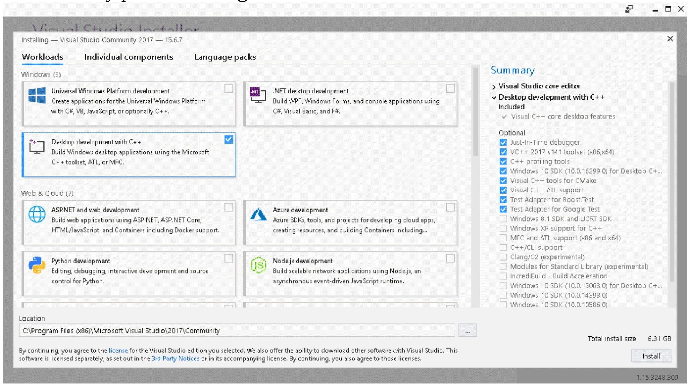
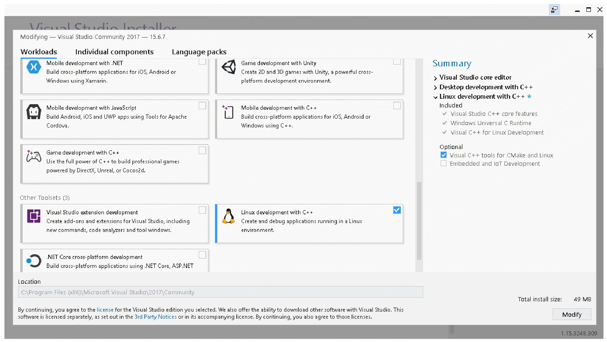
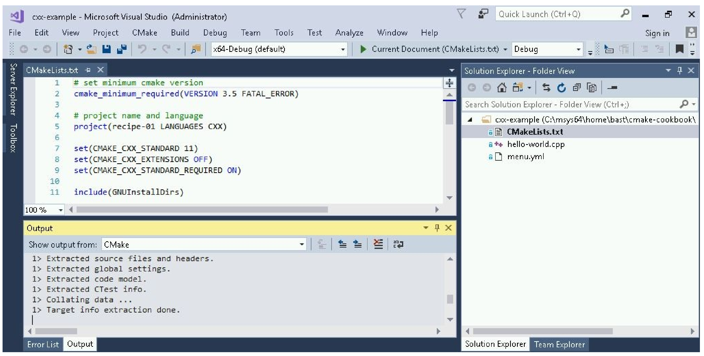
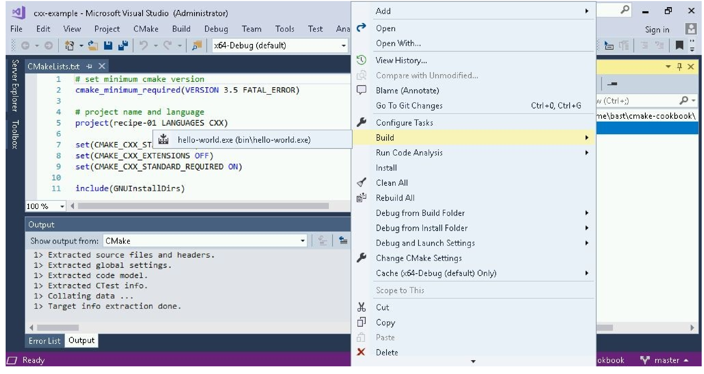
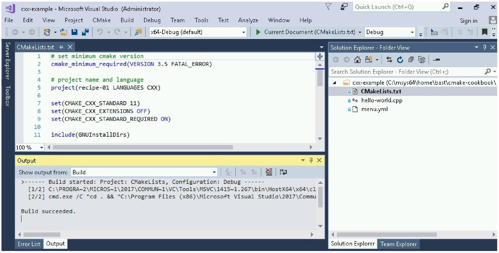
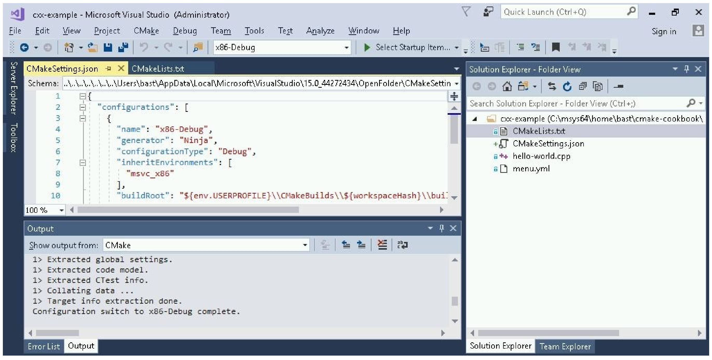

# 13.1 使用CMake构建Visual Studio 2017项目

**NOTE**:*此示例代码可以在 https://github.com/dev-cafe/cmake-cookbook/tree/v1.0/chapter-13/recipe-01 中找到，其中包含一个C++示例。该示例在CMake 3.5版(或更高版本)中是有效的，并且已经在GNU/Linux、macOS和Windows上进行过测试。*

早期版本的Visual Studio要求开发人员在不同的Windows版本中编辑源代码并运行CMake命令，但Visual Studio 2017引入了对CMake项目的内置支持( https://aka.ms/cmake )，它允许在同一个IDE中发生整个编码、配置、构建和测试工作流。本示例中，不需要使用命令行，我们将直接使用Visual Studio 2017构建一个简单的“hello world”CMake示例项目。

## 准备工作

首先，下载并安装Visual Studio Community 2017 (https://www.visualstudio.com/downloads/ )。在撰写本文时，这个版本是免费的，有30天的试用期。我们将遵循的视频中的步骤:https://www.youtube.com/watch?v=_lKxJjV8r3Y

运行安装程序时，在左侧面板上选择`Desktop development with C++`，并在右侧的Summary面板上选择用于CMake的Visual C++工具：



Visual Studio 2017 15.4中，还可以为Linux平台进行构建。为此，在工具集中选择`Linux development with C++`:



选择后，只要配置Linux服务器的访问权限，就可以从Visual Studio中同时对Windows和Linux机器进行构建。我们不在本章中演示这种方法。

这个示例中，我们将在Windows上构建一个二进制文件，我们的目标是配置和构建以下示例代码(`hello-world.cpp`)：

```c++
#include <cstdlib>
#include <iostream>
#include <string>
const std::string cmake_system_name = SYSTEM_NAME;
int main() {
  std::cout << "Hello from " << cmake_system_name << std::endl;
  
  return EXIT_SUCCESS;
}
```

## 具体实施

创建相应的源码：

1. 创建一个目录，并将`hello-world.cpp`放在新目录中。

2. 目录中，创建一个`CMakeLists.txt`文件，其内容为:

   ```cmake
   # set minimum cmake version
   cmake_minimum_required(VERSION 3.5 FATAL_ERROR)
   
   # project name and language
   project(recipe-01 LANGUAGES CXX)
   
   set(CMAKE_CXX_STANDARD 11)
   set(CMAKE_CXX_EXTENSIONS OFF)
   set(CMAKE_CXX_STANDARD_REQUIRED ON)
   
   include(GNUInstallDirs)
   set(CMAKE_ARCHIVE_OUTPUT_DIRECTORY
     ${CMAKE_BINARY_DIR}/${CMAKE_INSTALL_LIBDIR})
   set(CMAKE_LIBRARY_OUTPUT_DIRECTORY
     ${CMAKE_BINARY_DIR}/${CMAKE_INSTALL_LIBDIR})
   set(CMAKE_RUNTIME_OUTPUT_DIRECTORY
     ${CMAKE_BINARY_DIR}/${CMAKE_INSTALL_BINDIR})
   
   # define executable and its source file
   add_executable(hello-world hello-world.cpp)
   
   # we will print the system name in the code
   target_compile_definitions(hello-world
     PUBLIC
       "SYSTEM_NAME=\"${CMAKE_SYSTEM_NAME}\""
     )
   
   install(
     TARGETS
       hello-world
     DESTINATION
       ${CMAKE_INSTALL_BINDIR}
     )
   ```

3. 打开Visual Studio 2017，然后通过下面的`File ->Open ->
   Folder`，选择到新创建的包含源文件和`CMakeLists.txt`的文件夹下。

4. 打开文件夹后，请注意CMake配置步骤是如何运行的(面板底部)：

   

5. 现在，可以右键单击`CMakeLists.txt`(右面板)，并选择`Build`:

   

6. 构建项目(参见底部面板上的输出):

   

7. 这就成功地编译了可执行文件。下一小节中，我们将学习如何定位可执行文件，并更改构建和安装路径。

## 工作原理

我们已经看到Visual Studio 2017能很好地对接CMake，并且已经能够在IDE中配置和构建代码。除了构建步骤之外，还可以运行安装或测试步骤。可以通过右键单击`CMakeLists.txt`(右面板)，访问这些文件。

然而，配置步骤是自动运行的，我们可能更想去修改配置选项。我们还想知道实际的构建和安装路径，以便测试我们的可执行文件。为此，我们可以选择`CMake -> Change CMake Settings`，如下图所示:



面板左上角，可以检查和修改生成器(本例中是Ninja)、设置、参数以及路径。构建路径在前面的显示中可以看到。这些设置被分组为构建类型(`x86-Debug`、`x86-Release`等等)，我们可以在面板栏顶部的中间部分，通过选择切换构建类型。

现在知道了构建路径，可以测试编译后的可执行文件:

```shell
$ ./hello-world.exe

Hello from Windows
```

当然，构建和安装路径可以进行修改。

## 更多信息

* Visual Studio支持CMake:  https://aka.ms/cmake
* 使用CMake，基于Visual C++开发Linux应用：https://blogs.msdn.microsoft.com/vcblog/2017/08/25/visual-c-for-linux-development-with-cmake/
* Visual Studio官方文档：https://www.visualstudio.com/vs/features/ide/