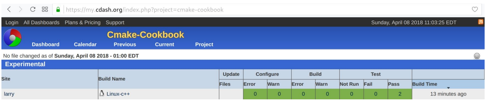
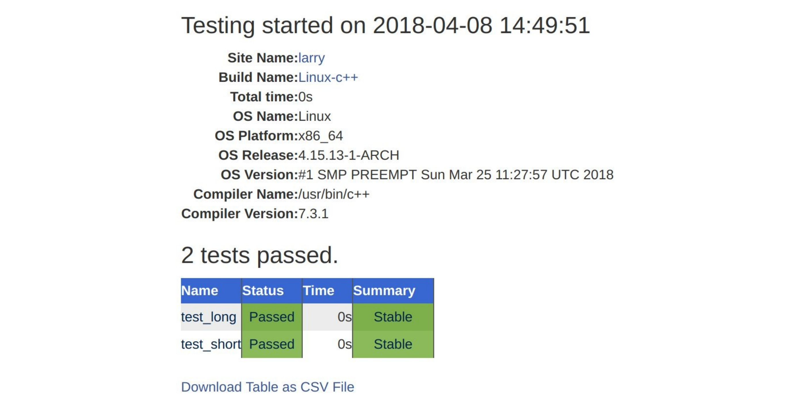

# 14.1 将测试部署到CDash

**NOTE**:*此示例代码可以在 https://github.com/dev-cafe/cmake-cookbook/tree/v1.0/chapter-14/recipe-01 中找到，其中包含一个C++示例。该示例在CMake 3.5版(或更高版本)中是有效的，并且已经在GNU/Linux、macOS和Windows上进行过测试。*

本示例中，我们将扩展第4章第1节的测试示例，并将测试结果部署到https://my.cdash.org/index.php?project=cmake-cookbook ，这是在Kitware为社区提供的公共面板( https://my.cdash.org )的基础上，为本书创建的专属面板。

## 准备工作

我们将从重用第1节中的示例源代码，该测试将整数作为命令行参数进行求和。该示例由三个源文件组成:`main.cpp`、`sum_integer.cpp`和`sum_integers.hpp`。我们还将重用第4章(创建和运行测试)中的`test.cpp`文件，但这里将它重命名为`test_short.cpp`。我们将使用`test_long.cpp`扩展这个例子:

```c++
#include "sum_integers.hpp"

#include <numeric>
#include <vector>

int main() {
  
  // creates vector {1, 2, 3, ..., 999, 1000}
  std::vector integers(1000);
  std::iota(integers.begin(), integers.end(), 1);

	if (sum_integers(integers) == 500500) {
  	return 0;
  } else {
  	return 1;
  }
}
```
然后，将这些文件组织成以下文件树:

```shell
.
├── CMakeLists.txt
├── CTestConfig.cmake
├── src
│    ├── CMakeLists.txt
│    ├── main.cpp
│    ├── sum_integers.cpp
│    └── sum_integers.hpp
└── tests
    ├── CMakeLists.txt
    ├── test_long.cpp
    └── test_short.cpp
```

## 具体实施

现在，我们将演示如何配置、构建、测试。最后，将示例项目的测试结果提交到面板的过程：

1. 源目标在`src/CMakeLists.txt`中定义，如下：

   ```cmake
   # example library
   add_library(sum_integers "")
   
   target_sources(sum_integers
     PRIVATE
     	sum_integers.cpp
     PUBLIC
     	${CMAKE_CURRENT_LIST_DIR}/sum_integers.hpp
     )
   
   target_include_directories(sum_integers
     PUBLIC
     	${CMAKE_CURRENT_LIST_DIR}
     )
   
   # main code
   add_executable(sum_up main.cpp)
   
   target_link_libraries(sum_up sum_integers)
   ```

2. `tests/CMakeLists.txt`中定义了测试：

   ```cmake
   add_executable(test_short test_short.cpp)
   target_link_libraries(test_short sum_integers)
   
   add_executable(test_long test_long.cpp)
   target_link_libraries(test_long sum_integers)
   
   add_test(
     NAME
     	test_short
     COMMAND
     	$<TARGET_FILE:test_short>
     )
   
   add_test(
     NAME
     	test_long
     COMMAND
     	$<TARGET_FILE:test_long>
     )
   ```

3. 主`CMakeLists.txt`文件引用前面的两个文件，这个配置中的新元素是`include(CTest)`，这样就可以向CDash仪表板报告结果：

   ```cmake
   # set minimum cmake version
   cmake_minimum_required(VERSION 3.5 FATAL_ERROR)
   
   # project name and language
   project(recipe-01 LANGUAGES CXX)
   
   # require C++11
   set(CMAKE_CXX_STANDARD 11)
   set(CMAKE_CXX_EXTENSIONS OFF)
   set(CMAKE_CXX_STANDARD_REQUIRED ON)
   
   # process src/CMakeLists.txt
   add_subdirectory(src)
   enable_testing()
   
   # allow to report to a cdash dashboard
   include(CTest)
   
   # process tests/CMakeLists.txt
   add_subdirectory(tests)
   ```

4. 另外，我们创建文件`CTestConfig.cmake`与主`CMakeLists.txt`文件位于同一目录中。这个新文件包含以下几行：

   ```cmake
   set(CTEST_DROP_METHOD "http")
   set(CTEST_DROP_SITE "my.cdash.org")
   set(CTEST_DROP_LOCATION "/submit.php?project=cmake-cookbook")
   set(CTEST_DROP_SITE_CDASH TRUE)
   ```

5. 我们现在已经准备好配置和构建项目：

   ```shell
   $ mkdir -p build
   $ cd build
   $ cmake ..
   $ cmake --build .
   ```

6. 构建后，运行测试集，并向面板报告测试结果：

   ```shell
   $ ctest --dashboard Experimental
   
   Site: larry
   Build name: Linux-c++
   Create new tag: 20180408-1449 - Experimental
   Configure project
   Each . represents 1024 bytes of output
   . Size of output: 0K
   Build project
   Each symbol represents 1024 bytes of output.
   '!' represents an error and '*' a warning.
   . Size of output: 0K
   0 Compiler errors
   0 Compiler warnings
   Test project /home/user/cmake-recipes/chapter-15/recipe-01/cxx-example/build
   Start 1: test_short
   1/2 Test #1: test_short ....................... Passed 0.00 sec
   Start 2: test_long
   2/2 Test #2: test_long ........................ Passed 0.00 sec
   100% tests passed, 0 tests failed out of 2
   Total Test time (real) = 0.01 sec
   Performing coverage
   Cannot find any coverage files. Ignoring Coverage request.
   Submit files (using http)
   Using HTTP submit method
   Drop site:http://my.cdash.org/submit.php?project=cmake-cookbook
   Uploaded: /home/user/cmake-recipes/chapter-14/recipe-01/cxx-example/build/Testing/20180408-1449/Build.xml
   Uploaded: /home/user/cmake-recipes/chapter-14/recipe-01/cxx-example/build/Testing/20180408-1449/Configure.xml
   Uploaded: /home/user/cmake-recipes/chapter-14/recipe-01/cxx-example/build/Testing/20180408-1449/Test.xml
   Submission successful
   ```

7. 最后，可以在浏览器中看到测试结果(本例中，测试结果上报到 https://my.cdash.org/index.php?project=cmake-cookbook ):

   

## 工作原理

可以从更高级的角度展示工作流，CTest运行测试并在XML文件中记录结果。然后，将这些XML文件发送到CDash服务器，在那里可以浏览和分析它们。通过单击数字`2`，获得关于通过或失败测试的更多的细节信息(本例中，没有失败的测试)。如下图所示，详细记录了运行测试的机器的信息，以及时间信息。同样，单个测试的测试输出也可以在线浏览。



CTest支持三种不同的提交模式：

* 实验性构建
* 夜间构建
* 持续构建

我们使用了` ctest --dashboard Experimental `(实验性构建提交)，因此，测试结果显示在实验模式之下。实验模式对于测试代码的当前状态、调试新的仪表板脚本、调试CDash服务器或项目非常有用。夜间构建模式，将把代码更新(或降级)到最接近最近夜间构建开始时的存储库，这些可以在`  CTestConfig.cmake `中设置。其为接收更新频繁的项目的所有夜间测试提供一个定义良好的参考。例如，夜间开始时间可以设置为世界时的"午夜"：

```cmake
set(CTEST_NIGHTLY_START_TIME "00:00:00 UTC")
```

持续模式对于集成工作流非常有用，它将把代码更新到最新版本。

**TIPS**:*构建、测试和提交到实验面板只需要一个命令—` cmake --build . --target Experimental`*

## 更多信息

这个示例中，我们直接从测试目标部署到CDash。我们将在本章后面的第3和第4部分中，使用专用的CTest脚本。

CDash不仅可以监视测试是否通过或失败，还可以看到测试时间。可以为测试计时进行配置：如果测试花费的时间超过分配的时间，它将被标记为失败。这对于基准测试非常有用，可以在重构代码时自动检测性能测试用例的性能情况。

有关CDash定义和配置设置的详细讨论，请参见官方CDash文档，网址为 https://public.kitware.com/Wiki/CDash:Documentation