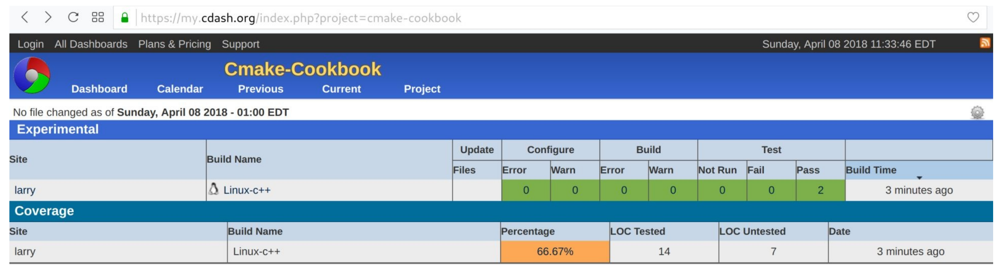
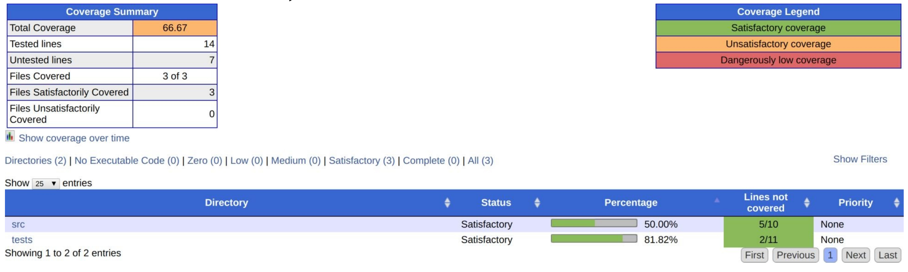
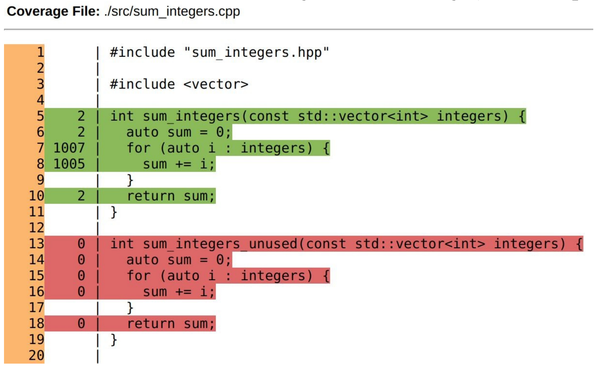

# 14.2 CDash显示测试覆盖率

**NOTE**:*此示例代码可以在 https://github.com/dev-cafe/cmake-cookbook/tree/v1.0/chapter-14/recipe-02 中找到，其中包含一个C++示例。该示例在CMake 3.5版(或更高版本)中是有效的，并且已经在GNU/Linux、macOS和Windows上进行过测试。*

本示例中，我们将测试覆盖率报告给CDash，面板上将能够逐行浏览测试覆盖率分析，以便识别未测试或未使用的代码。

## 准备工作

我们将扩展前一节的源代码，在`src/sum_integers.cpp`中做一个小的修改，添加一个函数` sum_integers_unused `:

```c++
#include "sum_integers.hpp"

#include <vector>

int sum_integers(const std::vector integers) {
  auto sum = 0;
  
  for (auto i : integers) {
  	sum += i;
  }
  
  return sum;
}

int sum_integers_unused(const std::vector integers) {
  auto sum = 0;
  
  for (auto i : integers) {
  	sum += i;
  }
  
  return sum;
}
```

我们使用gcov(https://gcc.gnu.org/onlinedocs/gcc/Gcov.html )通过覆盖率分析检测这个未使用的代码。

## 具体实施

通过以下步骤，我们将使用覆盖率分析，并将结果上传到面板：

1. 主`CMakeLists.txt`和`tests/CMakeLists.txt`文件与前一个示例相同。

2. 我们将扩展`src/CMakeLists.txt`，并提供一个选项来添加用于代码覆盖率的编译标志。此选项默认启用:

   ```cmake
   option(ENABLE_COVERAGE "Enable coverage" ON)
   
   if(ENABLE_COVERAGE)
     if(CMAKE_CXX_COMPILER_ID MATCHES GNU)
       message(STATUS "Coverage analysis with gcov enabled")
       target_compile_options(sum_integers
         PUBLIC
         	-fprofile-arcs -ftest-coverage -g
         )
       target_link_libraries(sum_integers
         PUBLIC
         	gcov
         )
     else()
     	message(WARNING "Coverage not supported for this compiler")
     endif()
   endif()
   ```

3. 然后，配置、构建，并将结果上传CDash:

   ```shell
   $ mkdir -p build
   $ cd build
   $ cmake ..
   $ cmake --build . --target Experimental
   ```

4. 最后一步，执行测试覆盖率分析:

   ```cmake
     Performing coverage
     Processing coverage (each . represents one file):
     ...
     Accumulating results (each . represents one file):
     ...
       Covered LOC: 14
       Not covered LOC: 7
       Total LOC: 21
       Percentage Coverage: 66.67%
   Submit files (using http)
     Using HTTP submit method
     Drop site:http://my.cdash.org/submit.php?project=cmake-cookbook
     Uploaded: /home/user/cmake-recipes/chapter-14/recipe-02/cxx-example/build/Testing/20180408-1530/Build.xml
     Uploaded: /home/user/cmake-recipes/chapter-14/recipe-02/cxx-example/build/Testing/20180408-1530/Configure.xml
     Uploaded: /home/user/cmake-recipes/chapter-14/recipe-02/cxx-example/build/Testing/20180408-1530/Coverage.xml
     Uploaded: /home/user/cmake-recipes/chapter-14/recipe-02/cxx-example/build/Testing/20180408-1530/CoverageLog-0.xml
     Uploaded: /home/user/cmake-recipes/chapter-14/recipe-02/cxx-example/build/Testing/20180408-1530/Test.xml
     Submission successful
   ```

5. 最后，可以在浏览器中验证测试结果(本例的测试结果报告在 https://my.cdash.org/index.php?project=cmake-cookbook ):

   

## 工作原理

测试覆盖率为66.67%。为了得到更深入的了解，我们可以点击百分比，得到两个子目录的覆盖率分析:



通过浏览子目录链接，我们可以检查单个文件的测试覆盖率，甚至可以逐行浏览摘要(例如，`src/sum_integs.cpp`)：



运行测试时，绿线部分已经被覆盖，而红线部分则没有。通过这个方法，我们不仅可以标识未使用的/未测试的代码(使用`sum_integers_used`函数)，还可以查看每一行代码被遍历的频率。例如，代码行`sum += i`已经被访问了1005次(在`test_short`期间访问了5次，在`test_long`期间访问了1000次)。测试覆盖率分析是自动化测试不可或缺的功能，CDash为我们提供了一个界面，可以在浏览器中图形化地浏览分析结果。

## 更多信息

为了更多的了解该特性，我们推荐读者阅读下面的博客文章，它更深入的讨论了CDash的覆盖特性：https://blog.kitware.com/additional-coverage-features-in-cdash/