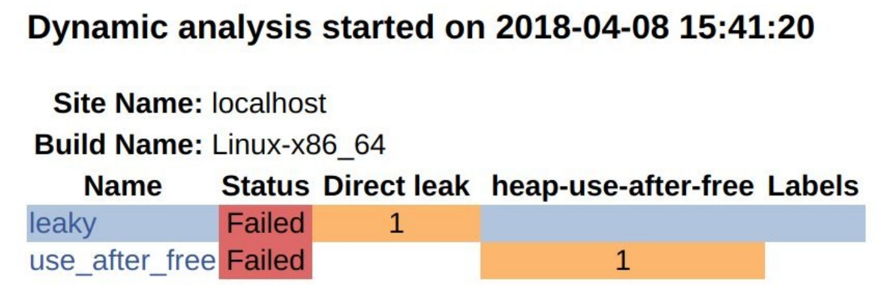

# 14.3 使用AddressSanifier向CDash报告内存缺陷

**NOTE**:*此示例代码可以在 https://github.com/dev-cafe/cmake-cookbook/tree/v1.0/chapter-14/recipe-03 中找到，其中包含一个C++示例和一个Fortran例子。该示例在CMake 3.5版(或更高版本)中是有效的，并且已经在GNU/Linux、macOS和Windows上进行过测试。*

AddressSanitizer(ASan)是可用于C++、C和Fortran的内存检测。它可以发现内存缺陷，比如：在空闲后使用、返回后使用、作用域后使用、缓冲区溢出、初始化顺序错误和内存泄漏(请参见  https://github.com/google/sanitizers/wiki/AddressSanitizer )。从3.1版本开始，AddressSanitizer是LLVM的一部分；从4.8版本开始，作为GCC的一部分。在这个示例中，我们将在代码中加入两个bug，正常的测试中可能无法检测到。为了检测这些bug，我们将使用AddressSanitizer工具，并将CTest与动态分析结合起来，从而将缺陷报告给CDash。

## 准备工作

这个例子中，我们将使用两个源文件和两个测试集：

```shell
.
├── CMakeLists.txt
├── CTestConfig.cmake
├── dashboard.cmake
├── src
│    ├── buggy.cpp
│    ├── buggy.hpp
│    └── CMakeLists.txt
└── tests
    ├── CMakeLists.txt
    ├── leaky.cpp
    └── use_after_free.cpp
```

`buggy.cpp`包含有两个bug：

```c++
#include "buggy.hpp"

#include <iostream>

int function_leaky() {
  double *my_array = new double[1000];
  // do some work ...
  // we forget to deallocate the array
  // delete[] my_array;
  return 0;
}

int function_use_after_free() {
  double *another_array = new double[1000];
  // do some work ...
  // deallocate it, good!
  delete[] another_array;
  // however, we accidentally use the array
  // after it has been deallocated
  std::cout << "not sure what we get: " << another_array[123] << std::endl;
  return 0;
}
```

这些函数在相应的头文件中声明(`buggy.hpp`）：

```c++
#pragma once
int function_leaky();
int function_use_after_free();
```

测试文件`leaky.cpp`中将会验证`function_leaky`的返回值：

```c++
#include "buggy.hpp"
int main() {
  int return_code = function_leaky();
  return return_code;
}
```

相应地，`use_after_free.cpp`会检查`function_use_after_free`的返回值:

```c++
#include "buggy.hpp"
int main() {
  int return_code = function_use_after_free();
  return return_code;
}
```

## 具体实施

为了使用ASan，我们需要使用特定的标志来编译代码。然后，我们将运行测试并将它们提交到面板。

1. 生成bug库的工作将在` src/CMakeLists.txt`中完成：

   ```cmake
   add_library(buggy "")
   
   target_sources(buggy
     PRIVATE
     	buggy.cpp
     PUBLIC
     	${CMAKE_CURRENT_LIST_DIR}/buggy.hpp
     )
     
   target_include_directories(buggy
     PUBLIC
     	${CMAKE_CURRENT_LIST_DIR}
     )
   ```

2. 在文件`src/CMakeLists.txt`中，我们将添加一个选项用于使用ASan：

   ```cmake
   option(ENABLE_ASAN "Enable AddressSanitizer" OFF)
   
   if(ENABLE_ASAN)
     if(CMAKE_CXX_COMPILER_ID MATCHES GNU)
       message(STATUS "AddressSanitizer enabled")
       target_compile_options(buggy
         PUBLIC
         	-g -O1 -fsanitize=address -fno-omit-frame-pointer
         )
       target_link_libraries(buggy
         PUBLIC
         	asan
         )
     else()
     	message(WARNING "AddressSanitizer not supported for this compiler")
     endif()
   endif()
   ```

3. 测试在`tests/CMakeLists.txt`中定义:

   ```cmake
   foreach(_test IN ITEMS leaky use_after_free)
     add_executable(${_test} ${_test}.cpp)
     target_link_libraries(${_test} buggy)
     
     add_test(
       NAME
       	${_test}
       COMMAND
       	$<TARGET_FILE:${_test}>
       )
   endforeach()
   ```

4. 主`CMakeLists.txt`与之前的示例基本相同：

   ```cmake
   # set minimum cmake version
   cmake_minimum_required(VERSION 3.5 FATAL_ERROR)
   
   # project name and language
   project(recipe-03 LANGUAGES CXX)
   
   # require C++11
   set(CMAKE_CXX_STANDARD 11)
   set(CMAKE_CXX_EXTENSIONS OFF)
   set(CMAKE_CXX_STANDARD_REQUIRED ON)
   
   # process src/CMakeLists.txt
   add_subdirectory(src)
   enable_testing()
   
   # allow to report to a cdash dashboard
   include(CTest)
   
   # process tests/CMakeLists.txt
   add_subdirectory(tests)
   ```

5. ` CTestConfig.cmake `也没有修改：

   ```cmake
   set(CTEST_DROP_METHOD "http")
   set(CTEST_DROP_SITE "my.cdash.org")
   set(CTEST_DROP_LOCATION "/submit.php?project=cmake-cookbook")
   set(CTEST_DROP_SITE_CDASH TRUE)
   ```

6. 这个示例中，我们使用CTest脚本向CDash提交结果；为此，我们将创建一个文件` dashboard.cmake`(与主`CMakeLists.txt`和`` CTestConfig.cmake`位于同一个目录下)：

   ```cmake
   set(CTEST_PROJECT_NAME "example")
   cmake_host_system_information(RESULT _site QUERY HOSTNAME)
   set(CTEST_SITE ${_site})
   set(CTEST_BUILD_NAME "${CMAKE_SYSTEM_NAME}-${CMAKE_HOST_SYSTEM_PROCESSOR}")
   
   set(CTEST_SOURCE_DIRECTORY "${CTEST_SCRIPT_DIRECTORY}")
   set(CTEST_BINARY_DIRECTORY "${CTEST_SCRIPT_DIRECTORY}/build")
   
   include(ProcessorCount)
   ProcessorCount(N)
   if(NOT N EQUAL 0)
     set(CTEST_BUILD_FLAGS -j${N})
     set(ctest_test_args ${ctest_test_args} PARALLEL_LEVEL ${N})
   endif()
   
   ctest_start(Experimental)
   
   ctest_configure(
     OPTIONS
     	-DENABLE_ASAN:BOOL=ON
     )
   
   ctest_build()
   ctest_test()
   
   set(CTEST_MEMORYCHECK_TYPE "AddressSanitizer")
   ctest_memcheck()
   
   ctest_submit()
   ```

7. 我们将执行` dashboard.cmake`脚本。注意，我们使用`CTEST_CMAKE_GENERATOR`与生成器选项的方式：

   ```shell
   $ ctest -S dashboard.cmake -D 
   
   CTEST_CMAKE_GENERATOR="Unix Makefiles"
   Each . represents 1024 bytes of output
   . Size of output: 0K
   Each symbol represents 1024 bytes of output.
   '!' represents an error and '*' a warning.
   . Size of output: 1K
   ```

8. 结果将会出现在CDash网站上:

   

## 具体实施

这个示例中，成功地向仪表板的动态分析部分报告了内存错误。我们可以通过浏览缺陷详细信息，得到进一步的了解:



通过单击各个链接，可以浏览完整信息的输出。

注意，也可以在本地生成AddressSanitizer报告。这个例子中，我们需要设置`ENABLE_ASAN`:

```shell
$ mkdir -p build
$ cd build
$ cmake -DENABLE_ASAN=ON ..
$ cmake --build .
$ cmake --build . --target test

Start 1: leaky
1/2 Test #1: leaky ............................***Failed 0.07 sec
Start 2: use_after_free
2/2 Test #2: use_after_free ...................***Failed 0.04 sec
0% tests passed, 2 tests failed out of 2
```

运行`leaky`测试，直接产生以下结果:

```shell
$ ./build/tests/leaky

=================================================================
==18536==ERROR: LeakSanitizer: detected memory leaks
Direct leak of 8000 byte(s) in 1 object(s) allocated from:
#0 0x7ff984da1669 in operator new[](unsigned long) /build/gcc/src/gcc/libsanitizer/asan/asan_new_delete.cc:82
#1 0x564925c93fd2 in function_leaky() /home/user/cmake-recipes/chapter-14/recipe-03/cxx-example/src/buggy.cpp:7
#2 0x564925c93fb2 in main /home/user/cmake-recipes/chapter-14/recipe-03/cxx-example/tests/leaky.cpp:4
#3 0x7ff98403df49 in __libc_start_main (/usr/lib/libc.so.6+0x20f49)
SUMMARY: AddressSanitizer: 8000 byte(s) leaked in 1 allocation(s).
```

相应地，我们可以直接运行`use_after_free`，得到详细的输出:

```shell
$ ./build/tests/use_after_free

=================================================================
==18571==ERROR: AddressSanitizer: heap-use-after-free on address 0x6250000004d8 at pc 0x557ffa8b0102 bp 0x7ffe8c560200 sp 0x7ffe8c5601f0
READ of size 8 at 0x6250000004d8 thread T0
#0 0x557ffa8b0101 in function_use_after_free() /home/user/cmake-recipes/chapter-14/recipe-03/cxx-example/src/buggy.cpp:28
#1 0x557ffa8affb2 in main /home/user/cmake-recipes/chapter-14/recipe-03/cxx-example/tests/use_after_free.cpp:4
#2 0x7ff1d6088f49 in __libc_start_main (/usr/lib/libc.so.6+0x20f49)
#3 0x557ffa8afec9 in _start (/home/user/cmake-recipes/chapter-14/recipe-03/cxx-example/build/tests/use_after_free+0xec9)
0x6250000004d8 is located 984 bytes inside of 8000-byte region [0x625000000100,0x625000002040)
freed by thread T0 here:
#0 0x7ff1d6ded5a9 in operator delete[](void*) /build/gcc/src/gcc/libsanitizer/asan/asan_new_delete.cc:128
#1 0x557ffa8afffa in function_use_after_free() /home/user/cmake-recipes/chapter-14/recipe-03/cxx-example/src/buggy.cpp:24
#2 0x557ffa8affb2 in main /home/user/cmake-recipes/chapter-14/recipe-03/cxx-example/tests/use_after_free.cpp:4
#3 0x7ff1d6088f49 in __libc_start_main (/usr/lib/libc.so.6+0x20f49)
previously allocated by thread T0 here:
#0 0x7ff1d6dec669 in operator new[](unsigned long) /build/gcc/src/gcc/libsanitizer/asan/asan_new_delete.cc:82
#1 0x557ffa8affea in function_use_after_free() /home/user/cmake-recipes/chapter-14/recipe-03/cxx-example/src/buggy.cpp:19
#2 0x557ffa8affb2 in main /home/user/cmake-recipes/chapter-14/recipe-03/cxx-example/tests/use_after_free.cpp:4
#3 0x7ff1d6088f49 in __libc_start_main (/usr/lib/libc.so.6+0x20f49)
SUMMARY: AddressSanitizer: heap-use-after-free /home/user/cmake-recipes/chapter-14/recipe-03/cxx-example/src/buggy.cpp:28 in function_use_after_free()
Shadow bytes around the buggy address:
0x0c4a7fff8040: fd fd fd fd fd fd fd fd fd fd fd fd fd fd fd fd
0x0c4a7fff8050: fd fd fd fd fd fd fd fd fd fd fd fd fd fd fd fd
0x0c4a7fff8060: fd fd fd fd fd fd fd fd fd fd fd fd fd fd fd fd
0x0c4a7fff8070: fd fd fd fd fd fd fd fd fd fd fd fd fd fd fd fd
0x0c4a7fff8080: fd fd fd fd fd fd fd fd fd fd fd fd fd fd fd fd
=>0x0c4a7fff8090: fd fd fd fd fd fd fd fd fd fd fd[fd]fd fd fd fd
0x0c4a7fff80a0: fd fd fd fd fd fd fd fd fd fd fd fd fd fd fd fd
0x0c4a7fff80b0: fd fd fd fd fd fd fd fd fd fd fd fd fd fd fd fd
0x0c4a7fff80c0: fd fd fd fd fd fd fd fd fd fd fd fd fd fd fd fd
0x0c4a7fff80d0: fd fd fd fd fd fd fd fd fd fd fd fd fd fd fd fd
0x0c4a7fff80e0: fd fd fd fd fd fd fd fd fd fd fd fd fd fd fd fd
Shadow byte legend (one shadow byte represents 8 application bytes):
Addressable: 00
Partially addressable: 01 02 03 04 05 06 07
Heap left redzone: fa
Freed heap region: fd
Stack left redzone: f1
Stack mid redzone: f2
Stack right redzone: f3
Stack after return: f5
Stack use after scope: f8
Global redzone: f9
Global init order: f6
Poisoned by user: f7
Container overflow: fc
Array cookie: ac
Intra object redzone: bb
ASan internal: fe
Left alloca redzone: ca
Right alloca redzone: cb
==18571==ABORTING
```

如果我们在没有AddressSanitizer的情况下进行测试(默认情况下`ENABLE_ASAN`是关闭的)，就不会报告错误：

```shell
$ mkdir -p build_no_asan
$ cd build_no_asan
$ cmake ..
$ cmake --build .
$ cmake --build . --target test

Start 1: leaky
1/2 Test #1: leaky ............................ Passed 0.00 sec
Start 2: use_after_free
2/2 Test #2: use_after_free ................... Passed 0.00 sec
100% tests passed, 0 tests failed out of 2
```

实际上，泄漏只会浪费内存，而`use_after_free`可能会导致未定义行为。调试这些问题的一种方法是使用valgrind (http://valgrind.org )。

与前两个示例相反，我们使用了CTest脚本来配置、构建和测试代码，并将报告提交到面板。要了解此示例的工作原理，请仔细查看`  dashboard.cmake `脚本。首先，我们定义项目名称并设置主机报告和构建名称:

```cmake
set(CTEST_PROJECT_NAME "example")
cmake_host_system_information(RESULT _site QUERY HOSTNAME)
set(CTEST_SITE ${_site})
set(CTEST_BUILD_NAME "${CMAKE_SYSTEM_NAME}-${CMAKE_HOST_SYSTEM_PROCESSOR}")
```

我们的例子中，`CTEST_BUILD_NAME`的计算结果是`Linux-x86_64`。不同的操作系统下，可能会观察到不同的结果。

接下来，我们为源和构建目录指定路径:

```cmake
set(CTEST_SOURCE_DIRECTORY "${CTEST_SCRIPT_DIRECTORY}")
set(CTEST_BINARY_DIRECTORY "${CTEST_SCRIPT_DIRECTORY}/build")
```

我们可以将生成器设置为`Unix Makefile`:

```cmake
set(CTEST_CMAKE_GENERATOR "Unix Makefiles")
```

但是，对于更具可移植性的测试脚本，我们更愿意通过命令行提供生成器:

```shell
$ ctest -S dashboard.cmake -D CTEST_CMAKE_GENERATOR="Unix Makefiles"
```

` dashboard.cmake`中的下一个代码片段，将计算出机器上可用的CPU芯数量，并将测试步骤的并行级设置为可用CPU芯数量，以使总测试时间最小化:

```cmake
include(ProcessorCount)
ProcessorCount(N)
if(NOT N EQUAL 0)
	set(CTEST_BUILD_FLAGS -j${N})
	set(ctest_test_args ${ctest_test_args} PARALLEL_LEVEL ${N})
endif()
```

接下来，我们开始测试步骤并配置代码，将`ENABLE_ASAN`设置为`ON`:

```cmake
ctest_start(Experimental)

ctest_configure(
  OPTIONS
  	-DENABLE_ASAN:BOOL=ON
  )
```

` dashboard.cmake `其他命令为映射到构建、测试、内存检查和提交步骤:

```cmake
ctest_build()
ctest_test()

set(CTEST_MEMORYCHECK_TYPE "AddressSanitizer")

ctest_memcheck()
ctest_submit()
```

## 更多信息

细心的读者会注意到，在链接目标之前，我们没有在系统上搜索AddressSanitizer。实际中，库查找工作已经提前做完，以避免在链接阶段出现意外。

有关AddressSanitizer文档和示例的更多信息，请参见https://github.com/google/sanitizers/wiki/AddressSanitizer 。AddressSanitizer并不仅限于C和C++。对于Fortran示例，读者可以参考 https://github.com/dev-cafe/cmake-cookbook/tree/v1.0/chapter-14/recipe-03/fortran-example 。

**NOTE**:*可以在https://github.com/arsenm/sanitizers-cmake 上找到CMake程序，用来查找杀毒程序和调整编译器标志*

下面的博客文章讨论了如何添加对动态分析工具的支持，对我们很有启发性：https://blog.kitware.com/ctest-cdash-add-support-for-new-dynamic-analysis-tools/