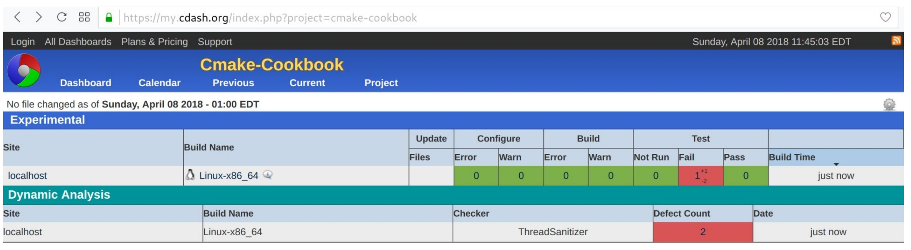
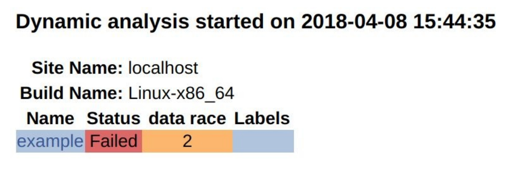

# 14.4 使用ThreadSaniiser向CDash报告数据争用

**NOTE**:*此示例代码可以在 https://github.com/dev-cafe/cmake-cookbook/tree/v1.0/chapter-14/recipe-03 中找到，其中包含一个C++示例。该示例在CMake 3.5版(或更高版本)中是有效的，并且已经在GNU/Linux、macOS和Windows上进行过测试。*

在这个示例中，我们将重用前一个示例中的方法，但是使用ThreadSanitizer或TSan，结合CTest和CDash，来检查数据竞争，并将它们报告给CDash。ThreadSanitizer的文档可以在网上找到，https://github.com/google/sanitizers/wiki/ThreadSanitizerCppManual

## 准备工作

这个示例中，我们将使用以下示例代码(`example.cpp`):

```c++
#include <chrono>
#include <iostream>
#include <thread>

static const int num_threads = 16;

void increase(int i, int &s) {
  std::this_thread::sleep_for(std::chrono::seconds(1));
  std::cout << "thread " << i << " increases " << s++ << std::endl;
}

int main() {
  std::thread t[num_threads];
  
  int s = 0;
  
  // start threads
  for (auto i = 0; i < num_threads; i++) {
  	t[i] = std::thread(increase, i, std::ref(s));
  }
  
  // join threads with main thread
  for (auto i = 0; i < num_threads; i++) {
  	t[i].join();
  }
  
  std::cout << "final s: " << s << std::endl;
  
  return 0;
}
```

这个示例代码中，我们启动16个线程，每个线程都调用`increase`函数。`increase`函数休眠1s，然后打印并递增一个整数`s`。我们预计此示例代码将显示数据竞争，因为所有线程读取和修改相同的地址，而不需要任何显式同步或协调。换句话说，我们期望在代码末尾打印的最终`s`，每次的结果都不同。代码有bug，我们将尝试在ThreadSanitizer的帮助下识别数据竞争。如果不运行ThreadSanitizer，我们可能不会看到代码有任何问题:

```shell
$ ./example

thread thread 0 increases 01 increases 1
thread 9 increases 2
thread 4 increases 3
thread 10 increases 4
thread 2 increases 5
thread 3 increases 6
thread 13 increases 7
thread thread 7 increases 8
thread 14 increases 9
thread 8 increases 10
thread 12 increases 11
thread 15 increases 12
thread 11 increases 13

5 increases 14
thread 6 increases 15
final s: 16
```

## 具体实施

1. 文件`CMakeLists.txt`首先定义一个受支持的最低版本、项目名称、受支持的语言。在本例中，定义了C++11标准项目:

   ```cmake
   cmake_minimum_required(VERSION 3.5 FATAL_ERROR)
   
   project(recipe-04 LANGUAGES CXX)
   
   set(CMAKE_CXX_STANDARD 11)
   set(CMAKE_CXX_EXTENSIONS OFF)
   set(CMAKE_CXX_STANDARD_REQUIRED ON)
   ```

2. 接下来，找到线程库，定义可执行文件，并将其链接到线程库:

   ```cmake
   find_package(Threads REQUIRED)
   
   add_executable(example example.cpp)
   
   target_link_libraries(example
     PUBLIC
     	Threads::Threads
     )
   ```

3. 然后，提供编译选项和代码，并链接到ThreadSanitizer:

   ```cmake
   option(ENABLE_TSAN "Enable ThreadSanitizer" OFF)
   
   if(ENABLE_TSAN)
     if(CMAKE_CXX_COMPILER_ID MATCHES GNU)
       message(STATUS "ThreadSanitizer enabled")
       target_compile_options(example
       PUBLIC
       	-g -O1 -fsanitize=thread -fno-omit-frame-pointer -fPIC
       )
       target_link_libraries(example
         PUBLIC
           tsan
         )
     else()
     	message(WARNING "ThreadSanitizer not supported for this compiler")
     endif()
   endif()
   ```

4. 最后，编译测试用例:

   ```cmake
   enable_testing()
   
   # allow to report to a cdash dashboard
   include(CTest)
   
   add_test(
     NAME
     	example
     COMMAND
     	$<TARGET_FILE:example>
     )
   ```

5. ` CTestConfig.cmake`没有变化:

   ```cmake
   set(CTEST_DROP_METHOD "http")
   set(CTEST_DROP_SITE "my.cdash.org")
   set(CTEST_DROP_LOCATION "/submit.php?project=cmake-cookbook")
   set(CTEST_DROP_SITE_CDASH TRUE)
   ```

6. `dashboard.cmake `需要为TSan进行简单修改:

   ```cmake
   set(CTEST_PROJECT_NAME "example")
   cmake_host_system_information(RESULT _site QUERY HOSTNAME)
   set(CTEST_SITE ${_site})
   set(CTEST_BUILD_NAME "${CMAKE_SYSTEM_NAME}-${CMAKE_HOST_SYSTEM_PROCESSOR}")
   
   set(CTEST_SOURCE_DIRECTORY "${CTEST_SCRIPT_DIRECTORY}")
   set(CTEST_BINARY_DIRECTORY "${CTEST_SCRIPT_DIRECTORY}/build")
   
   include(ProcessorCount)
   ProcessorCount(N)
   if(NOT N EQUAL 0)
     set(CTEST_BUILD_FLAGS -j${N})
     set(ctest_test_args ${ctest_test_args} PARALLEL_LEVEL ${N})
   endif()
   
   ctest_start(Experimental)
   
   ctest_configure(
     OPTIONS
     	-DENABLE_TSAN:BOOL=ON
     )
     
   ctest_build()
   ctest_test()
   
   set(CTEST_MEMORYCHECK_TYPE "ThreadSanitizer")
   ctest_memcheck()
   
   ctest_submit()
   ```

7. 让我们以这个例子为例。通过`CTEST_CMAKE_GENERATOR`选项来设置生成器:

   ```shell
   $ ctest -S dashboard.cmake -D CTEST_CMAKE_GENERATOR="Unix Makefiles"
   
   Each . represents 1024 bytes of output
   . Size of output: 0K
   Each symbol represents 1024 bytes of output.
   '!' represents an error and '*' a warning.
   . Size of output: 0K
   ```

8. 在面板上，我们将看到以下内容:

   

9. 我们可以看到更详细的动态分析:

   

## 工作原理

该示例`CMakeLists.txt`的核心部分:

```cmake
option(ENABLE_TSAN "Enable ThreadSanitizer" OFF)

if(ENABLE_TSAN)
  if(CMAKE_CXX_COMPILER_ID MATCHES GNU)
    message(STATUS "ThreadSanitizer enabled")
    target_compile_options(example
    PUBLIC
    	-g -O1 -fsanitize=thread -fno-omit-frame-pointer -fPIC
    )
    target_link_libraries(example
      PUBLIC
        tsan
      )
  else()
  	message(WARNING "ThreadSanitizer not supported for this compiler")
  endif()
endif()
```

`dashboard.cmake`也需要更新:

```cmake
# ...

ctest_start(Experimental)

ctest_configure(
  OPTIONS
  	-DENABLE_TSAN:BOOL=ON
  )

ctest_build()
ctest_test()

set(CTEST_MEMORYCHECK_TYPE "ThreadSanitizer")
ctest_memcheck()

ctest_submit()
```

和上一个示例一样，我们也可以在本地查看ThreadSanitizer的输出:

```shell
$ mkdir -p build
$ cd build
$ cmake -DENABLE_TSAN=ON ..
$ cmake --build .
$ cmake --build . --target test

Start 1: example
1/1 Test #1: example ..........................***Failed 1.07 sec
0% tests passed, 1 tests failed out of 1
$ ./build/example
thread 0 increases 0
==================
WARNING: ThreadSanitizer: data race (pid=24563)
... lots of output ...
SUMMARY: ThreadSanitizer: data race /home/user/cmake-recipes/chapter-14/recipe-04/cxx-example/example
```

## 更多信息

对使用OpenMP的应用TSan是很常见的，但是请注意，在某些情况下，OpenMP会在TSan下生成误检的结果。对于Clang编译器，一个解决方案是用`-DLIBOMP_TSAN_SUPPORT=TRUE`重新编译编译器本身及其`libomp`。通常，以合理的方式使用TSan可能需要重新编译整个工具堆栈，以避免误报。在使用pybind11的C++项目的情况，我们可能需要重新编译Python，并启用TSan来获得有意义的东西。或者，Python绑定可以通过使用TSan抑制而被排除在外，如 https://github.com/google/sanitizers/wiki/threadsanitizersuppression 。例如：如果一个动态库同时被一个经过TSan的二进制文件和一个Python插件调用，那么这种情况可能是不可能使用TSan。

下面的博客文章讨论了如何添加对动态分析工具的支持：https://blog.kitware.com/ctest-cdash-add-support-for-new-dynamic-analysis-tools/