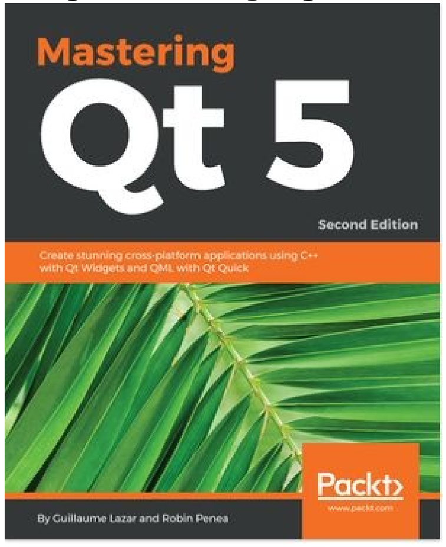
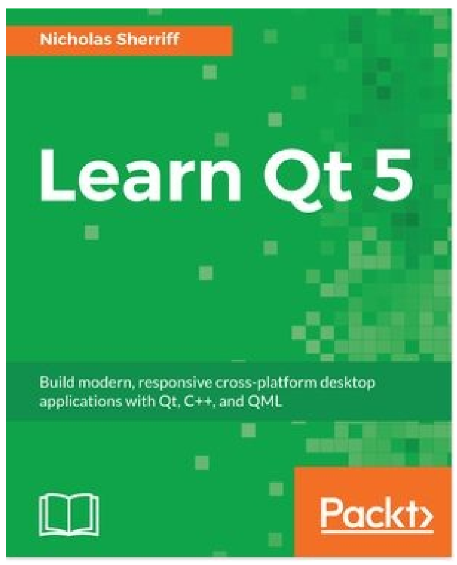

# 第16章 可能感兴趣的书

如果你喜欢本书，你可能会对Packt的其他书感兴趣:

**Mastering Qt 5 - Second Edition**

Guillaume Lazar, Robin Penea

ISBN: 978-1-78899-539-9

* 使用Qt Widgets和Qt Quick 2创建漂亮的UI
* 使用Qt框架开发功能强大的跨平台应用程序
* 使用Qt设计器设计GUI，并在其中构建用于UI预览的库
* 在C++中处理用户与Qt信号/插槽机制的交互
* 准备跨平台项目来托管第三方库
* 使用Qt动画框架来创造惊人的效果
* 使用Qt和嵌入式平台部署移动应用程序
* 使用Qt Gamepad与游戏平板交互

**Learn QT 5**

Nicholas Sherriff

ISBN: 978-1-78847-885-4

* 安装/配置Qt框架和Qt Creator IDE
* 使用QMake控制创建一个新的多项目解决方案
* 用QML实现一个丰富的用户界面
* 学习QtTest的基础知识，以及如何集成单元测试
* 构建自我感知的数据实体，这些数据实体和JSON进行互相转换
* 使用SQLite和CRUD管理数据
* 接触互联网并使用RSS
* 生成应用程序包以分发给其他用户