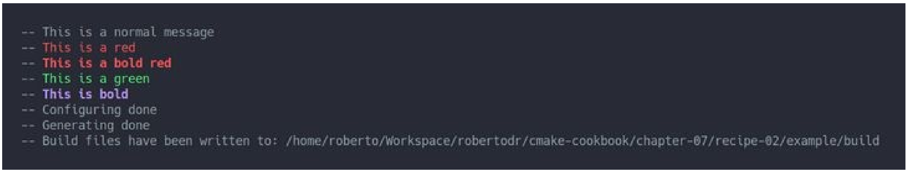

# 7.2 将CMake源代码分成模块

**NOTE**:*此示例代码可以在 https://github.com/dev-cafe/cmake-cookbook/tree/v1.0/chapter-7/recipe-02 中找到。该示例在CMake 3.5版(或更高版本)中是有效的，并且已经在GNU/Linux、macOS和Windows上进行过测试。*

项目通常从单个`CMakeLists.txt`文件开始，随着时间的推移，这个文件会逐渐增长。本示例中，我们将演示一种将`CMakeLists.txt`分割成更小单元的机制。将`CMakeLists.txt`拆分为模块有几个动机，这些模块可以包含在主`CMakeLists.txt`或其他模块中:

* 主`CMakeLists.txt`更易于阅读。
* CMake模块可以在其他项目中重用。
* 与函数相结合，模块可以帮助我们限制变量的作用范围。

本示例中，我们将演示如何定义和包含一个宏，该宏允许我们获得CMake的彩色输出(用于重要的状态消息或警告)。

## 准备工作

本例中，我们将使用两个文件，主`CMakeLists.txt`和`cmake/colors.cmake`:

```shell
.
├── cmake
│     └── colors.cmake
└── CMakeLists.txt
```

` cmake/colors.cmake`文件包含彩色输出的定义:

```cmake
# colorize CMake output
# code adapted from stackoverflow: http://stackoverflow.com/a/19578320
# from post authored by https://stackoverflow.com/users/2556117/fraser
macro(define_colors)
  if(WIN32)
    # has no effect on WIN32
    set(ColourReset "")
    set(ColourBold "")
    set(Red "")
    set(Green "")
    set(Yellow "")
    set(Blue "")
    set(Magenta "")
    set(Cyan "")
    set(White "")
    set(BoldRed "")
    set(BoldGreen "")
    set(BoldYellow "")
    set(BoldBlue "")
    set(BoldMagenta "")
    set(BoldCyan "")
    set(BoldWhite "")
  else()
    string(ASCII 27 Esc)
    set(ColourReset "${Esc}[m")
    set(ColourBold "${Esc}[1m")
    set(Red "${Esc}[31m")
    set(Green "${Esc}[32m")
    set(Yellow "${Esc}[33m")
    set(Blue "${Esc}[34m")
    set(Magenta "${Esc}[35m")
    set(Cyan "${Esc}[36m")
    set(White "${Esc}[37m")
    set(BoldRed "${Esc}[1;31m")
    set(BoldGreen "${Esc}[1;32m")
    set(BoldYellow "${Esc}[1;33m")
    set(BoldBlue "${Esc}[1;34m")
    set(BoldMagenta "${Esc}[1;35m")
    set(BoldCyan "${Esc}[1;36m")
    set(BoldWhite "${Esc}[1;37m")
  endif()
endmacro()
```

## 具体实施

来看下我们如何使用颜色定义，来生成彩色状态消息:

1. 从一个熟悉的头部开始:

   ```cmake
   cmake_minimum_required(VERSION 3.5 FATAL_ERROR)
   project(recipe-02 LANGUAGES NONE)
   ```

2. 然后，将`cmake`子目录添加到CMake模块搜索的路径列表中:

   ```cmake
   list(APPEND CMAKE_MODULE_PATH "${CMAKE_CURRENT_SOURCE_DIR}/cmake")
   ```

3. 包括` colors.cmake`模块，调用其中定义的宏:

   ```cmake
   include(colors)
   define_colors()
   ```

4. 最后，打印了不同颜色的信息:

   ```cmake
   message(STATUS "This is a normal message")
   message(STATUS "${Red}This is a red${ColourReset}")
   message(STATUS "${BoldRed}This is a bold red${ColourReset}")
   message(STATUS "${Green}This is a green${ColourReset}")
   message(STATUS "${BoldMagenta}This is bold${ColourReset}")
   ```

5. 测试一下(如果使用macOS或Linux，以下的输出应该出现屏幕上):

## 工作原理

这个例子中，不需要编译代码，也不需要语言支持，我们已经用` LANGUAGES NONE `明确了这一点：

```cmake
project(recipe-02 LANGUAGES NONE)
```

我们定义了`define_colors`宏，并将其放在`cmake/colors.cmake`。因为还是希望使用调用宏中定义的变量，来更改消息中的颜色，所以我们选择使用宏而不是函数。我们使用以下行包括宏和调用`define_colors`:

```cmake
include(colors)
define_colors()
```

我们还需要告诉CMake去哪里查找宏:

```cmae
list(APPEND CMAKE_MODULE_PATH "${CMAKE_CURRENT_SOURCE_DIR}/cmake")
```

`include(colors)`命令指示CMake搜索`${CMAKE_MODULE_PATH}`，查找名称为`colors.cmake`的模块。

例子中，我们没有按以下的方式进行：

```cmake
list(APPEND CMAKE_MODULE_PATH "${CMAKE_CURRENT_SOURCE_DIR}/cmake")
include(colors)
```

而是使用一个显式包含的方式:

```cmake
include(cmake/colors.cmake)
```

## 更多信息

推荐的做法是在模块中定义宏或函数，然后调用宏或函数。将包含模块用作函数调用不是很好的方式。除了定义函数和宏以及查找程序、库和路径之外，包含模块不应该做更多的事情。实际的`include`命令不应该定义或修改变量，其原因是重复的`include`(可能是偶然的)不应该引入任何不想要的副作用。在第5节中，我们将创建一个防止多次包含的保护机制。