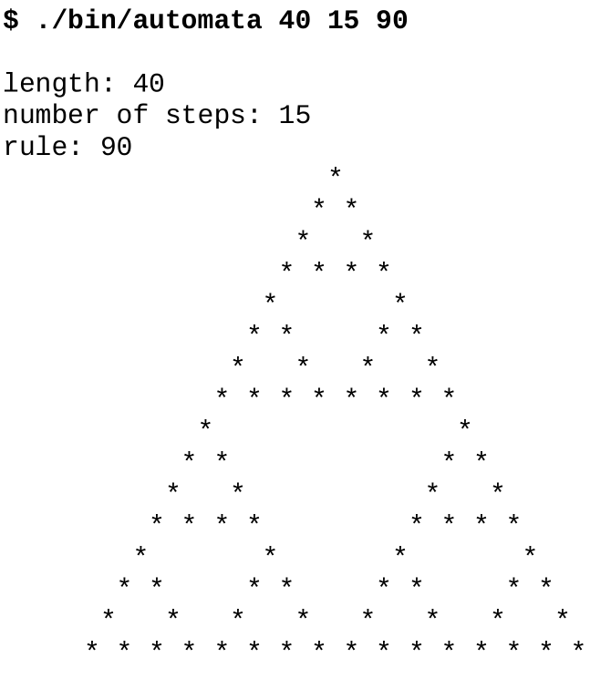

# 7.7 add_subdirectory的限定范围

**NOTE**:*此示例代码可以在 https://github.com/dev-cafe/cmake-cookbook/tree/v1.0/chapter-7/recipe-07 中找到，其中有一个C++示例。该示例在CMake 3.5版(或更高版本)中是有效的，并且已经在GNU/Linux、macOS和Windows上进行过测试。*

本章剩下的示例中，我们将讨论构建项目的策略，并限制变量的范围和副作用，目的是降低代码的复杂性和简化项目的维护。这个示例中，我们将把一个项目分割成几个范围有限的CMakeLists.txt文件，这些文件将使用`add_subdirectory`命令进行处理。

## 准备工作

由于我们希望展示和讨论如何构造一个复杂的项目，所以需要一个比“hello world”项目更复杂的例子:

* https://en.wikipedia.org/wiki/Cellular_automaton#Elementary_cellular_automata
* http://mathworld.wolfram.com/ElementaryCellularAutomaton.html

我们的代码将能够计算任何256个基本细胞自动机，例如：规则90 (Wolfram代码):



我们示例代码项目的结构如下:

```shell
.
├── CMakeLists.txt
├── external
│    ├── CMakeLists.txt
│    ├── conversion.cpp
│    ├── conversion.hpp
│    └── README.md
├── src
│    ├── CMakeLists.txt
│    ├── evolution
│    │    ├── CMakeLists.txt
│    │    ├── evolution.cpp
│    │    └── evolution.hpp
│    ├── initial
│    │    ├── CMakeLists.txt
│    │    ├── initial.cpp
│    │    └── initial.hpp
│    ├── io
│    │    ├── CMakeLists.txt
│    │    ├── io.cpp
│    │    └── io.hpp
│    ├── main.cpp
│    └── parser
│        ├── CMakeLists.txt
│        ├── parser.cpp
│        └── parser.hpp
└── tests
    ├── catch.hpp
    ├── CMakeLists.txt
    └── test.cpp
```

我们将代码分成许多库来模拟真实的大中型项目，可以将源代码组织到库中，然后将库链接到可执行文件中。

主要功能在`src/main.cpp`中:

```c++
#include "conversion.hpp"
#include "evolution.hpp"
#include "initial.hpp"
#include "io.hpp"
#include "parser.hpp"

#include <iostream>

int main(int argc, char *argv[]) {
  // parse arguments
  int length, num_steps, rule_decimal;
  std::tie(length, num_steps, rule_decimal) = parse_arguments(argc, argv);
  
  // print information about parameters
  std::cout << "length: " << length << std::endl;
  std::cout << "number of steps: " << num_steps << std::endl;
  std::cout << "rule: " << rule_decimal << std::endl;
  
  // obtain binary representation for the rule
  std::string rule_binary = binary_representation(rule_decimal);
  
  // create initial distribution
  std::vector<int> row = initial_distribution(length);
  
  // print initial configuration
  print_row(row);
  
  // the system evolves, print each step
  for (int step = 0; step < num_steps; step++) {
    row = evolve(row, rule_binary);
    print_row(row);
  }
}
```

`external/conversion.cpp`文件包含要从十进制转换为二进制的代码。

我们在这里模拟这段代码是由`src`外部的“外部”库提供的:

```cmake
#include "conversion.hpp"
#include <bitset>
#include <string>
std::string binary_representation(const int decimal) {
	return std::bitset<8>(decimal).to_string();
}
```

`src/evolution/evolution.cpp`文件为一个时限传播系统:

```c++
#include "evolution.hpp"

#include <string>
#include <vector>

std::vector<int> evolve(const std::vector<int> row, const std::string rule_binary) {
  std::vector<int> result;

  for (auto i = 0; i < row.size(); ++i) {
    auto left = (i == 0 ? row.size() : i) - 1;
    auto center = i;
    auto right = (i + 1) % row.size();
    auto ancestors = 4 * row[left] + 2 * row[center] + 1 * row[right];
    ancestors = 7 - ancestors;
    auto new_state = std::stoi(rule_binary.substr(ancestors, 1));
    result.push_back(new_state);
  }
  return result;
}
```

`src/initial/initial.cpp`文件，对出进行初始化:

```cmake
#include "initial.hpp"

#include <vector>

std::vector<int> initial_distribution(const int length) {

  // we start with a vector which is zeroed out
  std::vector<int> result(length, 0);
  
  // more or less in the middle we place a living cell
  result[length / 2] = 1;
  
  return result;
}
```

`src/io/io.cpp`文件包含一个函数输出打印行:

```c++
#include "io.hpp"
#include <algorithm>
#include <iostream>
#include <vector>
void print_row(const std::vector<int> row) {
  std::for_each(row.begin(), row.end(), [](int const &value) {
  	std::cout << (value == 1 ? '*' : ' ');
  });
  std::cout << std::endl;
}
```

`src/parser/parser.cpp`文件解析命令行输入:

```c++
#include "parser.hpp"

#include <cassert>
#include <string>
#include <tuple>

std::tuple<int, int, int> parse_arguments(int argc, char *argv[]) {
  assert(argc == 4 && "program called with wrong number of arguments");
  
  auto length = std::stoi(argv[1]);
  auto num_steps = std::stoi(argv[2]);
  auto rule_decimal = std::stoi(argv[3]);
  
  return std::make_tuple(length, num_steps, rule_decimal);
}
```

最后，`tests/test.cpp`包含两个使用Catch2库的单元测试:

```c++
#include "evolution.hpp"

// this tells catch to provide a main()
// only do this in one cpp file
#define CATCH_CONFIG_MAIN
#include "catch.hpp"

#include <string>
#include <vector>

TEST_CASE("Apply rule 90", "[rule-90]") {
  std::vector<int> row = {0, 1, 0, 1, 0, 1, 0, 1, 0};
  std::string rule = "01011010";
  std::vector<int> expected_result = {1, 0, 0, 0, 0, 0, 0, 0, 1};
  REQUIRE(evolve(row, rule) == expected_result);
}

TEST_CASE("Apply rule 222", "[rule-222]") {
  std::vector<int> row = {0, 0, 0, 0, 1, 0, 0, 0, 0};
  std::string rule = "11011110";
  std::vector<int> expected_result = {0, 0, 0, 1, 1, 1, 0, 0, 0};
  REQUIRE(evolve(row, rule) == expected_result);
}
```

相应的头文件包含函数声明。有人可能会说，对于这个小代码示例，项目包含了太多子目录。请注意，这只是一个项目的简化示例，通常包含每个库的许多源文件，理想情况下，这些文件被放在到单独的目录中。

## 具体实施

让我们来详细解释一下CMake所需的功能:

1. `CMakeLists.txt`顶部非常类似于第1节，代码重用与函数和宏:

   ```cmake
   cmake_minimum_required(VERSION 3.5 FATAL_ERROR)
   
   project(recipe-07 LANGUAGES CXX)
   
   set(CMAKE_CXX_STANDARD 11)
   set(CMAKE_CXX_EXTENSIONS OFF)
   set(CMAKE_CXX_STANDARD_REQUIRED ON)
   
   include(GNUInstallDirs)
   set(CMAKE_ARCHIVE_OUTPUT_DIRECTORY
   ${CMAKE_BINARY_DIR}/${CMAKE_INSTALL_LIBDIR})
   set(CMAKE_LIBRARY_OUTPUT_DIRECTORY
   ${CMAKE_BINARY_DIR}/${CMAKE_INSTALL_LIBDIR})
   set(CMAKE_RUNTIME_OUTPUT_DIRECTORY
   ${CMAKE_BINARY_DIR}/${CMAKE_INSTALL_BINDIR})
   
   # defines targets and sources
   add_subdirectory(src)
   
   # contains an "external" library we will link to
   add_subdirectory(external)
   
   # enable testing and define tests
   enable_testing()
   add_subdirectory(tests)
   ```

2. 目标和源在`src/CMakeLists.txt`中定义(转换目标除外):

   ```cmake
   add_executable(automata main.cpp)
   
   add_subdirectory(evolution)
   add_subdirectory(initial)
   add_subdirectory(io)
   add_subdirectory(parser)
   
   target_link_libraries(automata
     PRIVATE
       conversion
       evolution
       initial
       io
       parser
     )
   ```

3. 转换库在`external/CMakeLists.txt`中定义:

   ```cmake
   add_library(conversion "")
   
   target_sources(conversion
     PRIVATE
       ${CMAKE_CURRENT_LIST_DIR}/conversion.cpp
     PUBLIC
       ${CMAKE_CURRENT_LIST_DIR}/conversion.hpp
     )
   
   target_include_directories(conversion
     PUBLIC
     	${CMAKE_CURRENT_LIST_DIR}
     )
   ```

4. `src/CMakeLists.txt`文件添加了更多的子目录，这些子目录又包含`CMakeLists.txt`文件。`src/evolution/CMakeLists.txt`包含以下内容:

   ```cmake
   add_library(evolution "")
   
   target_sources(evolution
     PRIVATE
     	evolution.cpp
     PUBLIC
     	${CMAKE_CURRENT_LIST_DIR}/evolution.hpp
     )
     
   target_include_directories(evolution
     PUBLIC
     	${CMAKE_CURRENT_LIST_DIR}
     )
   ```

5. 单元测试在`tests/CMakeLists.txt`中注册:

   ```cmake
   add_executable(cpp_test test.cpp)
   
   target_link_libraries(cpp_test evolution)
   
   add_test(
     NAME
     	test_evolution
     COMMAND
     	$<TARGET_FILE:cpp_test>
     )
   ```

6. 配置和构建项目产生以下输出:

   ```shell
   $ mkdir -p build
   $ cd build
   $ cmake ..
   $ cmake --build .
   
   Scanning dependencies of target conversion
   [ 7%] Building CXX object external/CMakeFiles/conversion.dir/conversion.cpp.o
   [ 14%] Linking CXX static library ../lib64/libconversion.a
   [ 14%] Built target conversion
   Scanning dependencies of target evolution
   [ 21%] Building CXX object src/evolution/CMakeFiles/evolution.dir/evolution.cpp.o
   [ 28%] Linking CXX static library ../../lib64/libevolution.a
   [ 28%] Built target evolution
   Scanning dependencies of target initial
   [ 35%] Building CXX object src/initial/CMakeFiles/initial.dir/initial.cpp.o
   [ 42%] Linking CXX static library ../../lib64/libinitial.a
   [ 42%] Built target initial
   Scanning dependencies of target io
   [ 50%] Building CXX object src/io/CMakeFiles/io.dir/io.cpp.o
   [ 57%] Linking CXX static library ../../lib64/libio.a
   [ 57%] Built target io
   Scanning dependencies of target parser
   [ 64%] Building CXX object src/parser/CMakeFiles/parser.dir/parser.cpp.o
   [ 71%] Linking CXX static library ../../lib64/libparser.a
   [ 71%] Built target parser
   Scanning dependencies of target automata
   [ 78%] Building CXX object src/CMakeFiles/automata.dir/main.cpp.o
   [ 85%] Linking CXX executable ../bin/automata
   [ 85%] Built target automata
   Scanning dependencies of target cpp_test
   [ 92%] Building CXX object tests/CMakeFiles/cpp_test.dir/test.cpp.o
   [100%] Linking CXX executable ../bin/cpp_test
   [100%] Built target cpp_test
   ```

7. 最后，运行单元测试:

   ```shell
   $ ctest
   
   Running tests...
   Start 1: test_evolution
   1/1 Test #1: test_evolution ................... Passed 0.00 sec
   100% tests passed, 0 tests failed out of 1
   ```

## 工作原理

我们可以将所有代码放到一个源文件中。不过，每次编辑都需要重新编译。将源文件分割成更小、更易于管理的单元是有意义的。可以将所有源代码都编译成一个库或可执行文件。实际上，项目更喜欢将源代码编译分成更小的、定义良好的库。这样做既是为了本地化和简化依赖项，也是为了简化代码维护。这意味着如在这里所做的那样，由许多库构建一个项目是一种常见的情况。

为了讨论CMake结构，我们可以从定义每个库的单个CMakeLists.txt文件开始，自底向上进行，例如`src/evolution/CMakeLists.txt`:

```cmake
add_library(evolution "")

target_sources(evolution
  PRIVATE
  	evolution.cpp
  PUBLIC
  	${CMAKE_CURRENT_LIST_DIR}/evolution.hpp
  )
  
target_include_directories(evolution
  PUBLIC
  	${CMAKE_CURRENT_LIST_DIR}
  )
```

这些单独的`CMakeLists.txt`文件定义了库。本例中，我们首先使用`add_library`定义库名，然后定义它的源和包含目录，以及它们的目标可见性：实现文件(`evolution.cpp`:`PRIVATE`)，而接口头文件` evolution.hpp `定义为`PUBLIC`，因为我们将在`main.cpp`和`test.cpp`中访问它。定义尽可能接近代码目标的好处是，对于该库的修改，只需要变更该目录中的文件即可；换句话说，也就是库依赖项被封装。

向上移动一层，库在`src/CMakeLists.txt`中封装:

```cmake
add_executable(automata main.cpp)

add_subdirectory(evolution)
add_subdirectory(initial)
add_subdirectory(io)
add_subdirectory(parser)

target_link_libraries(automata
  PRIVATE
    conversion
    evolution
    initial
    io
    parser
  )
```

文件在主`CMakeLists.txt`中被引用。这意味着使用`CMakeLists.txt`文件，构建我们的项目。这种方法对于许多项目来说是可用的，并且它可以扩展到更大型的项目，而不需要在目录间的全局变量中包含源文件列表。`add_subdirectory`方法的另一个好处是它隔离了作用范围，因为子目录中定义的变量在父范围中不能访问。

## 更多信息

使用`add_subdirectory`调用树构建项目的一个限制是，CMake不允许将`target_link_libraries`与定义在当前目录范围之外的目标一起使用。对于本示例来说，这不是问题。在下一个示例中，我们将演示另一种方法，我们不使用`add_subdirectory`，而是使用`module include`来组装不同的`CMakeLists.txt`文件，它允许我们链接到当前目录之外定义的目标。

CMake可以使用Graphviz图形可视化软件(http://www.graphviz.org )生成项目的依赖关系图:

```shell
$ cd build
$ cmake --graphviz=example.dot ..
$ dot -T png example.dot -o example.png
```

生成的图表将显示不同目录下的目标之间的依赖关系:


本书中，我们一直在构建源代码之外的代码，以保持源代码树和构建树是分开的。这是推荐的方式，允许我们使用相同的源代码配置不同的构建(顺序的或并行的，Debug或Release)，而不需要复制源代码，也不需要在源代码树中生成目标文件。使用以下代码片段，可以保护您的项目免受内部构建的影响:

```cmake
if(${PROJECT_SOURCE_DIR} STREQUAL ${PROJECT_BINARY_DIR})
	message(FATAL_ERROR "In-source builds not allowed. Please make a new directory (called a build directory) and run CMake from there.")
endif()
```

认识到构建结构与源结构类似很有用。示例中，将`message`打印输出插入到`src/CMakeLists.txt`中:

```cmake
message("current binary dir is ${CMAKE_CURRENT_BINARY_DIR}")
```

在`build`下构建项目时，我们将看到`build/src`的打印输出。

在CMake的3.12版本中，`OBJECT`库是组织大型项目的另一种可行方法。对我们的示例的惟一修改是在库的`CMakeLists.tx`t中。源文件将被编译成目标文件：既不存档到静态库中，也不链接到动态库中。例如：

```cmake
add_library(io OBJECT "")

target_sources(io
  PRIVATE
  	io.cpp
  PUBLIC
  	${CMAKE_CURRENT_LIST_DIR}/io.hpp
  )
  
target_include_directories(io
  PUBLIC
  	${CMAKE_CURRENT_LIST_DIR}
  )
```

主`CMakeLists.txt`保持不变:`automata`可执行目标将这些目标文件链接到最终的可执行文件。使用也有要求需求，例如：在对象库上设置的目录、编译标志和链接库，将被正确地继承。有关CMake 3.12中引入的对象库新特性的更多细节，请参考官方文档:  https://cmake.org/cmake/help/v3.12/manual/cmake-buildsystem.7.html#object-libraries