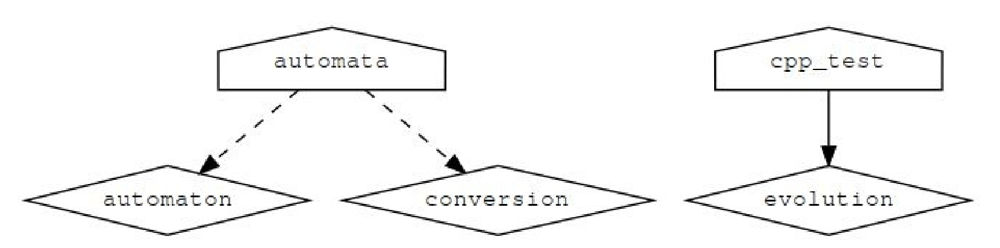

# 7.8 使用target_sources避免全局变量

**NOTE**:*此示例代码可以在 https://github.com/dev-cafe/cmake-cookbook/tree/v1.0/chapter-7/recipe-08 中找到，其中有一个C++示例。该示例在CMake 3.5版(或更高版本)中是有效的，并且已经在GNU/Linux、macOS和Windows上进行过测试。*

本示例中，我们将讨论前一个示例的另一种方法，并不使用`add_subdirectory`的情况下，使用`module include`组装不同的CMakeLists.txt文件。这种方法的灵感来自https://crascit.com/2016/01/31/enhance-sours-file-handling-with-target_sources/ ，其允许我们使用`target_link_libraries`链接到当前目录之外定义的目标。

## 准备工作

将使用与前一个示例相同的源代码。惟一的更改将出现在`CMakeLists.txt`文件中，我们将在下面的部分中讨论这些更改。

## 具体实施

1. 主`CMakeLists.txt`包含以下内容:

   ```cmake
   cmake_minimum_required(VERSION 3.5 FATAL_ERROR)
   
   project(recipe-08 LANGUAGES CXX)
   
   set(CMAKE_CXX_STANDARD 11)
   set(CMAKE_CXX_EXTENSIONS OFF)
   set(CMAKE_CXX_STANDARD_REQUIRED ON)
   
   include(GNUInstallDirs)
   set(CMAKE_ARCHIVE_OUTPUT_DIRECTORY
   ${CMAKE_BINARY_DIR}/${CMAKE_INSTALL_LIBDIR})
   set(CMAKE_LIBRARY_OUTPUT_DIRECTORY
   ${CMAKE_BINARY_DIR}/${CMAKE_INSTALL_LIBDIR})
   set(CMAKE_RUNTIME_OUTPUT_DIRECTORY
   ${CMAKE_BINARY_DIR}/${CMAKE_INSTALL_BINDIR})
   
   # defines targets and sources
   include(src/CMakeLists.txt)
   include(external/CMakeLists.txt)
   
   enable_testing()
   add_subdirectory(tests)
   ```

2. 与前一个示例相比，`external/CMakeLists.txt`文件没有变化。

3. `src/CMakeLists.txt `文件定义了两个库(automaton和evolution):

   ```cmake
   add_library(automaton "")
   add_library(evolution "")
   
   include(${CMAKE_CURRENT_LIST_DIR}/evolution/CMakeLists.txt)
   include(${CMAKE_CURRENT_LIST_DIR}/initial/CMakeLists.txt)
   include(${CMAKE_CURRENT_LIST_DIR}/io/CMakeLists.txt)
   include(${CMAKE_CURRENT_LIST_DIR}/parser/CMakeLists.txt)
   
   add_executable(automata "")
   
   target_sources(automata
     PRIVATE
     	${CMAKE_CURRENT_LIST_DIR}/main.cpp
     )
   
   target_link_libraries(automata
     PRIVATE
       automaton
       conversion
     )
   ```

4. `src/evolution/CMakeLists.txt`文件包含以下内容:

   ```cmake
   target_sources(automaton
     PRIVATE
     	${CMAKE_CURRENT_LIST_DIR}/evolution.cpp
     PUBLIC
     	${CMAKE_CURRENT_LIST_DIR}/evolution.hpp
     )
     
   target_include_directories(automaton
     PUBLIC
     	${CMAKE_CURRENT_LIST_DIR}
     )
     
   target_sources(evolution
     PRIVATE
     	${CMAKE_CURRENT_LIST_DIR}/evolution.cpp
     PUBLIC
     	${CMAKE_CURRENT_LIST_DIR}/evolution.hpp
     )
     
   target_include_directories(evolution
     PUBLIC
     	${CMAKE_CURRENT_LIST_DIR}
     )
   ```

5. 其余`CMakeLists.txt`文件和`src/initial/CMakeLists.txt`相同:

   ```cmake
   target_sources(automaton
     PRIVATE
     	${CMAKE_CURRENT_LIST_DIR}/initial.cpp
     PUBLIC
     	${CMAKE_CURRENT_LIST_DIR}/initial.hpp
     )
   
   target_include_directories(automaton
     PUBLIC
     	${CMAKE_CURRENT_LIST_DIR}
     )
   ```

6. 配置、构建和测试的结果与前面的方法相同:

   ```shell
   $ mkdir -p build
   $ cd build
   $ cmake ..
   $ cmake --build build
   $ ctest
   
   Running tests...
   Start 1: test_evolution
   1/1 Test #1: test_evolution ................... Passed 0.00 sec
   100% tests passed, 0 tests failed out of 1
   ```

## 工作原理

与之前的示例不同，我们定义了三个库:

* conversion(在external定义)
* automaton(包含除转换之外的所有源)
* evolution(在`src/evolution`中定义，并通过`cpp_test`链接)

本例中，通过使用`include()`引用`CMakeLists.txt`文件，我们在父范围内，仍然能保持所有目标可用:

```cmake
include(src/CMakeLists.txt)
include(external/CMakeLists.txt)
```

我们可以构建一个包含树，记住当进入子目录(`src/CMakeLists.txt`)时，我们需要使用相对于父范围的路径:

```cmake
include(${CMAKE_CURRENT_LIST_DIR}/evolution/CMakeLists.txt)
include(${CMAKE_CURRENT_LIST_DIR}/initial/CMakeLists.txt)
include(${CMAKE_CURRENT_LIST_DIR}/io/CMakeLists.txt)
include(${CMAKE_CURRENT_LIST_DIR}/parser/CMakeLists.txt)
```

这样，我们就可以定义并链接到通过`include()`语句访问文件树中任何位置的目标。但是，我们应该选择在对维护人员和代码贡献者容易看到的地方，去定义它们。

## 更多信息

我们可以再次使用CMake和Graphviz (http://www.graphviz.org/)生成这个项目的依赖关系图:

```shell
$ cd build
$ cmake --graphviz=example.dot ..
$ dot -T png example.dot -o example.png
```

对于当前设置，我们得到如下依赖关系图:

