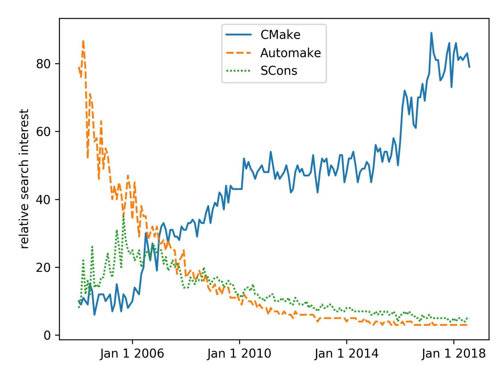
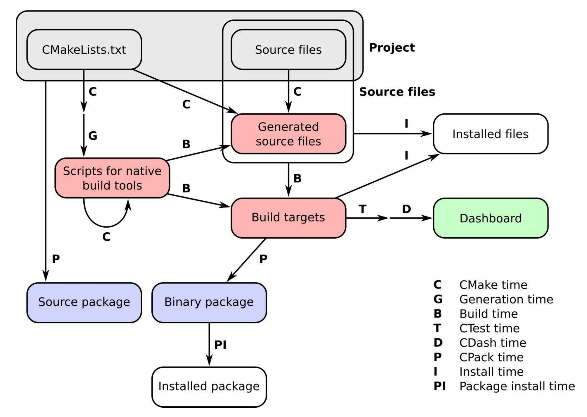

# 前言

我们日常生活的每一个方面都有计算机软件的存在：它可以为我们触发的闹钟，并每时每刻的为我们提供通信、银行、天气、公交、日历、会议、旅行、相册、电视、音乐流、社交媒体、晚餐和电影预定等服务信息。

软件内部具有一定的层次结构：应用程序是基于框架构建，框架基于开发库，开发库使用更小的库或可执行文件，当然还有更小的组件。开发库和可执行文件通常需要使用源代码进行构建。我们通常只看到最外层，但软件内部需要仔细组织和构建。本书就是使用CMake，对使用源代码构建开发库和可执行文件的项目进行组织。

CMake及其姊妹CTest、CPack和CDash已经成为源码构建的主要工具集，在使用和流行性方面超过了许多类似工具，例如备受推崇的GNU自动工具和最新的基于Python的[SCons](https://www.scons.org/)构建系统。




*随着时间的推移，搜索三个流行的构建系统：CMake、Automake和SCons。对比标准是通过搜索相关术语的次数来衡量的，其中数据由谷歌提供。*

CMake项目的始于1999年，当时开发公司Kitware被委托设计一套新的工具来简化研究人员的日常工作软件。目标很明确：提供一组工具，可以在不同平台上配置、构建、测试和部署项目。有关CMake项目中设计的精彩叙述，请访问 https://www.aosabook.org/en/cmake.html 。

CMake是一个构建生成器，提供了强大的领域特定语言(DSL)来描述构建系统应该实现的功能。这是CMake的主要优势之一，它允许使用相同的CMake脚本集生成平台原生构建系统。CMake软件工具集，使开发人员可以完全控制给定项目的生命周期：

* **CMake**是描述如何在所有主要硬件和操作系统上配置、构建和安装项目，无论是构建可执行文件、库，还是两者都要构建。
* **CTest**定义测试、测试套件，并设置应该如何执行。
* **CPack**为打包需求提供了DSL。
* **CDash**将项目的测试结果在面板中展示。

俗话说得好：挖得越深，发现的石头(阻碍，困难)越多。为了编写这本书，我们仔细地对软件层进行了深入挖掘，这也是CMake的目标。不同的平台上构建不同的软件组件和库时，我们遇到的阻碍和承受的工作量有时令人畏惧，且每个组件和库都有自己的特点。不过，我们已经清除了许多阻碍，也很高兴与读者分享我们的成果和技巧。En... 总会留下一些石头，但每一块石头都会带来新的理解，社区欢迎你分享这些理解。

## 适读人群

编写能够在许多不同平台上本地、可靠并高效地运行的软件，对于工业和社会的所有部门都至关重要。软件构建系统就是这项任务的中心。它们是软件开发生命周期管理的关键部分：从孵化和原型开发到测试，一直到打包、部署和发布。

CMake旨在帮助您管理这些操作：如果希望使用CMake管理构建系统的软件开发人员，或者希望能够理解，并能修改其他人编写的CMake代码，那么这本书非常合适您。

## 覆盖内容

本书中有一系列循序渐进的任务。每一任务中，我们都介绍了相关的CMake信息，从而展示如何实现目标，而不是用细节来折磨读者。本书的最后，您将能够自信地处理日益复杂的操作，并在自己的实际项目中利用书中的技巧。

我们将讨论以下内容：

* 使用CMake配置、构建、测试和安装代码项目
* 检测用于条件编译的操作系统、处理器、库、文件和程序
* 提高代码的可移植性
* CMake帮助下，将大型代码库重构为模块
* 构建多语言项目
* 知道如何调整他人编写的CMake配置文件
* 打包项目进行发布
* 将项目迁移为CMake构建

CMake管理的项目的工作流发生在许多阶段(time)，我们称之为*时序*。可以简洁地总结如下图：



* **CMake time**或**configure time**，是CMake运行时的情况。这个阶段中，CMake将处理项目中的CMakeLists.txt文件并配置它。
* **Generation time**配置成功后，CMake将生成本地构建工具所需的脚本，以执行项目中的后续步骤。
* **Build time**这是在平台和工具原生构建脚本上调用原生构建工具的时候，这些脚本以前是由CMake生成的。此时，将调用编译器，并在特定的构建目录中构建目标(可执行文件和库)。注意递归的CMake time箭头：这看起来令人困惑，但是我们将在本书中多次使用它，用来实现平台无关的构建。
* **CTest time**或 **test time**，运行项目的测试套件，以检查目标是否按预期执行。
* **CDash time**或**report time**，将测试结果上传到面板，与其他开发人员共享。
* **Install time**，将项目的目标、源文件、可执行文件和库从构建目录安装到安装位置。
* **CPack time**或**packaging time**，将项目打包以便发布，可以是源代码，也可以是二进制代码。
* **Package install time**，在系统范围内安装新生成的包。

本书的路线图如下：

第1章，从简单的可执行文件到库，如何配置和使用CMake构建简单的可执行文件和库。

第2章，检测环境，如何使用简单的CMake命令与操作系统和处理器体系结构交互。

第3章，检测外部库和程序，如何简化对项目依赖项的检测。

第4章，创建和运行测试，解释如何利用CMake和CTest的功能来定义和运行测试。

第5章，配置时操作和构建时操作，如何使用CMake在构建过程的不同阶段执行定制化操作。

第6章，生成源码，CMake命令可自动生成源码。

第7章，结构化项目，用于组织您的项目，使它们更易于维护。

第8章，超级构建，解释了CMake超级构建模式，用于管理关键项目的依赖关系。

第9章，混合语言项目，构建不同编程语言混合的项目。

第10章，编写一个安装程序，使用CMake安装项目。

第11章，打包项目，如何使用CPack生成源文件，并将源文件打包，以及构建用于发布的Python和Conda包。

第12章，生成文档，如何使用CMake也生成代码的文档。

第13章，选择生成器和交叉编译，如何使用CMake交叉编译项目。

第14章，测试面板，如何将测试结果报告到在面板上。

第15章，将项目移植到CMake中，将展示实践示例、注意事项和一些技巧，这些将帮助您将项目移植到基于CMake的构建系统中。


## 预备知识

这是一本为程序员写的书，我们假设您以具备一定的基本知识，并熟悉以下内容：

* 熟悉命令行方式
* 熟悉本地开发软件的环境
* 熟悉编译语言C++、C或Fortran，以及您使用的编译器
* 熟悉Python


##示例源码

您可以从 https://github.com/dev-cafe/cmake-cookbook 下载本书的示例代码示例。有关详细信息，请参见设置系统部分。


## 彩图下载

我们还提供了一个PDF文件，其中包含本书中使用的屏幕截图/图表的彩色图像。您可以在这里下载: http://www.packtpub.com/sites/default/files/downloads/CMakeCookbook_ColorImages.pdf 


##使用惯例

本书中使用了许多文本约定。

CodeInText：表示文本、文件夹名称、文件名、模块名称和目标名称中的代码命令。

代码块设置如下:

> cmake_minimum_required(VERSION 3.5 FATAL_ERROR)
>
> project(recipe-01 LANGUAGES CXX)
>
> add_executable(hello-world hello-world.cpp)

任何命令行输入都是粗体的，并在命令前面包含一个$提示符来输入:

```shell
$ mkdir -p build
$ cd build
$ cmake ..
```

为了区分命令行输入和输出，我们将输出设置为非粗体：(当前译本不支持)

```shell
$ ./hello-world
Hello World!
```

**NOTE** 重要的提示会出现该标识。

**TIPS** 提示和技巧会出现该标识。

(PS:原始标识由于在线上观看会使内容错位，观看体验下降，从而换成文字)

## 额外读物

CMake的在线文档非常全面，我们将在书中引用它: https://cmake.org/documentation/

编写这本书的过程中，我们还受到了其他文章的启发：

* Daniel Pfeifer在GitHub上的介绍:
  https://github.com/boostcon/cppnow_presentations_2017/blob/master/05-192017_friday/effective_cmake__daniel_pfeifer__cppnow_05-19-2017.pdf
* Eric Noulard编写的CMake教程，可以在GitHub上找到: https://github.com/TheErk/CMake-tutorial
* Craig Scott的“cmake相关”博文: https://crascit.com/tag/cmake/

我们还推荐浏览Viktor Kirilov收集的CMake资源、脚本、模块和示例的列表: https://github.com/onqtam/awesome-cmake

我们的书并不是唯一一本涉及CMake的书：

* 2015年，由Ken Martin和Bill Hoffman合著的《精通CMake》，Kitware Inc.出版。
*  Craig Scott的《Professional CMake》 https://crascit.com/professional-cmake/

## 联系方式

我们欢迎读者的反馈。

**源代码改进和问题**：请直接向 https://github.com/dev-cafe/cmake-cookbook 提出，并通过创建 https://github.com/dev-cafe/cmake-cookbook/issues 进行讨论

**内容反馈**：电子邮件 feedback@packtpub.com ，并在邮件主题中提到书名。如果你对本书的任何方面有任何疑问，请发邮件至 questions@packtpub.com

**勘误表**：虽然我们已经尽了一切努力确保我们的内容的准确性，但错误还是会有。如果您在这本书中发现了错误，务必告诉我们，不胜感激。可以访问 www.packtpub.com/submit-errata ，选择您的图书，单击Errata提交表单链接，并输入详细信息。

**盗版**：如果您在互联网上发现我们作品的任何形式的非法拷贝，希望提供相应地址或网站名称，我们将不胜感激。请通过 copyright@packtpub.com 联系我们，并提供该材料的链接。

**如果你对写作感兴趣**：如果有一个你擅长的主题，并且你对写作或为一本书做贡献感兴趣，请访问 authors.packtpub.com
